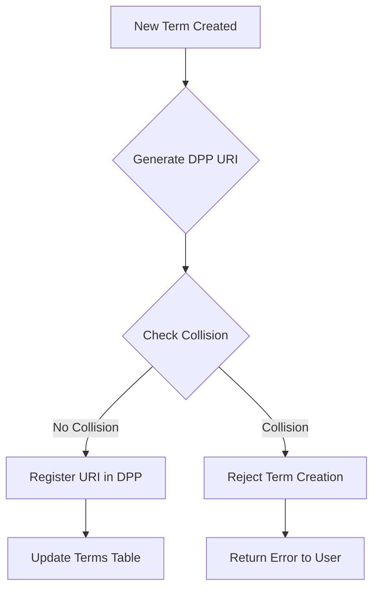

# KNU-96-10-001-ICD-002: DPP-Terminology Namespace Integration

**AMPEL360 Q100 BWB Hydrogen-Hybrid Aircraft Program**

---

## Document Information

| Field | Value |
|-------|-------|
| **KNU ID** | KNU-96-10-001-ICD-002 |
| **KNOT ID** | KNOT-96-10-001 |
| **Type** | Interface Control Document (ICD) |
| **Status** | 🔵 GENERATED |
| **Owner** | STK_DATA |
| **Due Date** | 2026-03-01 |
| **Priority** | HIGH |
| **Lifecycle Stage** | LC04_DESIGN_DEFINITION |
| **Spawned By** | TBD-00-006 (RESOLVED) |
| **Cross-KNOT** | KNOT-00-00-001 ↔ KNOT-96-10-001 |

---

## Purpose

This Interface Control Document specifies the integration between the Digital Product Passport (DPP) system and the terminology database, defining URI patterns, namespace collision prevention, and resolution mechanisms.

---

## DPP URI Patterns

### Terminology Namespace

**Pattern:**
```
ampel360:term:{term_id}
```

**Components:**
- **Prefix:** `ampel360:`
- **Namespace:** `term:`
- **Term ID:** Unique identifier from terminology database (lowercase, hyphen-separated)

**Examples:**
```
ampel360:term:bwb
ampel360:term:lh2
ampel360:term:fuel-cell
ampel360:term:blended-wing-body
ampel360:term:learning-assurance
```

**Resolution:**
- **Target:** Terminology database
- **Method:** HTTP GET to `/api/v1/terms/{term_id}`
- **Returns:** JSON object with term definition, metadata, relationships
- **Fallback:** S1000D CIR lookup if database unavailable

**Resolution Example:**
```bash
curl https://dpp.ampel360.aero/api/v1/terms/bwb

# Response:
{
  "term_id": "bwb",
  "term_name": "BWB",
  "full_form": "Blended Wing Body",
  "definition": "An aircraft configuration where...",
  "term_type": "ACRONYM",
  "status": "APPROVED",
  "created_at": "2026-01-10T12:00:00Z",
  "updated_at": "2026-01-10T12:00:00Z",
  "related_terms": ["fuselage", "wing"],
  "dpp_uri": "ampel360:term:bwb"
}
```

---

### Unit Namespace

**Pattern:**
```
ampel360:unit:{unit_symbol}
```

**Components:**
- **Prefix:** `ampel360:`
- **Namespace:** `unit:`
- **Unit Symbol:** Standard SI or derived unit symbol

**Examples:**
```
ampel360:unit:kg
ampel360:unit:K
ampel360:unit:bar
ampel360:unit:MJ
ampel360:unit:kWh
```

**Resolution:**
- **Target:** Unit conversion table
- **Method:** HTTP GET to `/api/v1/units/{unit_symbol}`
- **Returns:** JSON object with unit metadata, conversions, precision
- **Alignment:** QUDT (Quantities, Units, Dimensions and Types) ontology

**Resolution Example:**
```bash
curl https://dpp.ampel360.aero/api/v1/units/kg

# Response:
{
  "unit_symbol": "kg",
  "unit_name": "kilogram",
  "quantity_kind": "mass",
  "si_base": true,
  "dimension": "[M]",
  "conversions": {
    "to_pounds": 2.20462,
    "to_ounces": 35.274
  },
  "precision": 3,
  "dpp_uri": "ampel360:unit:kg",
  "qudt_alignment": "qudt:Kilogram"
}
```

---

### Component Namespace

**Pattern:**
```
ampel360:component:{serial_number}
```

**Components:**
- **Prefix:** `ampel360:`
- **Namespace:** `component:`
- **Serial Number:** Unique physical component identifier

**Examples:**
```
ampel360:component:FWD-LH2-TANK-001
ampel360:component:FC-STACK-02-L
ampel360:component:WING-PANEL-R-014
ampel360:component:BATTERY-MODULE-A3
```

**Resolution:**
- **Target:** Component registry (DPP database)
- **Method:** HTTP GET to `/api/v1/components/{serial_number}`
- **Returns:** JSON object with component lifecycle data, certifications, provenance
- **Blockchain:** Backed by immutable ledger for traceability

**Resolution Example:**
```bash
curl https://dpp.ampel360.aero/api/v1/components/FWD-LH2-TANK-001

# Response:
{
  "serial_number": "FWD-LH2-TANK-001",
  "component_type": "LH2_STORAGE_TANK",
  "ata_chapter": "28",
  "ata_section": "10",
  "manufacturer": "ACME Cryogenics",
  "manufacturing_date": "2025-11-15",
  "certification": {
    "standard": "EASA CS-25",
    "certificate_number": "EASA.21J.123",
    "expiry_date": "2035-11-15"
  },
  "lifecycle_events": [
    {
      "event": "MANUFACTURED",
      "date": "2025-11-15",
      "location": "Munich, Germany"
    },
    {
      "event": "INSTALLED",
      "date": "2026-02-01",
      "aircraft_serial": "Q100-MSN001"
    }
  ],
  "dpp_uri": "ampel360:component:FWD-LH2-TANK-001"
}
```

---

## Namespace Collision Prevention

### Reserved Prefixes

**Namespace Reservation Table:**

| Namespace | Purpose | Example | Reserved For |
|-----------|---------|---------|--------------|
| `term:` | Terminology only | `ampel360:term:bwb` | Glossary terms |
| `unit:` | Physical units only | `ampel360:unit:kg` | Unit conversion |
| `component:` | Physical parts only | `ampel360:component:FWD-LH2-TANK-001` | Component registry |
| `doc:` | Documents (DMC) | `ampel360:doc:DMC-AMPEL360-00-00-0-0-00-00A-001A-A` | S1000D DMs |
| `knu:` | Knowledge artifacts | `ampel360:knu:KNU-00-00-001-REQ-001` | SSOT artifacts |

**Collision Rules:**
1. **No cross-namespace identifiers:** An identifier cannot exist in multiple namespaces
2. **Case-insensitive uniqueness:** `ampel360:term:BWB` ≡ `ampel360:term:bwb`
3. **No special prefixes:** Identifiers cannot start with `ampel360:`, `term:`, `unit:`, etc.

---

### Validation Rules

**Pre-Registration Validation:**
```javascript
function validateDppUri(uri) {
  // Parse URI
  const match = uri.match(/^ampel360:(\w+):(.+)$/);
  if (!match) {
    throw new Error('Invalid DPP URI format');
  }
  
  const [_, namespace, identifier] = match;
  
  // Validate namespace
  const validNamespaces = ['term', 'unit', 'component', 'doc', 'knu'];
  if (!validNamespaces.includes(namespace)) {
    throw new Error(`Invalid namespace: ${namespace}`);
  }
  
  // Check for collisions
  if (checkCollision(uri)) {
    throw new Error(`URI already exists: ${uri}`);
  }
  
  return true;
}

function checkCollision(uri) {
  // Query DPP database for existing URI
  const exists = dppDatabase.query('SELECT COUNT(*) FROM dpp_uris WHERE uri = ?', [uri]);
  return exists > 0;
}
```

**Example Validation:**
```javascript
// Valid URIs
validateDppUri('ampel360:term:bwb');           // ✅ Valid
validateDppUri('ampel360:unit:kg');            // ✅ Valid
validateDppUri('ampel360:component:FWD-LH2-TANK-001'); // ✅ Valid

// Invalid URIs
validateDppUri('ampel360:term:kg');            // ❌ Collision with unit namespace
validateDppUri('ampel360:invalid:test');       // ❌ Invalid namespace
validateDppUri('ampel:term:bwb');              // ❌ Invalid prefix
```

---

### Integration with Terminology DB

**Database Schema Extension:**
```sql
-- Add DPP URI column to terms table
ALTER TABLE terms ADD COLUMN dpp_uri VARCHAR(255) UNIQUE;

-- Create index for fast lookups
CREATE INDEX idx_dpp_uri ON terms(dpp_uri);

-- Populate DPP URIs for existing terms
UPDATE terms 
SET dpp_uri = 'ampel360:term:' || term_id
WHERE status = 'APPROVED';

-- Add constraint to prevent collisions
ALTER TABLE terms ADD CONSTRAINT check_dpp_uri_format
  CHECK (dpp_uri ~ '^ampel360:term:[a-z0-9-]+$');
```

**Automatic DPP URI Generation:**
```python
def generate_dpp_uri(term_id: str) -> str:
    """Generate DPP URI for a term."""
    # Normalize term ID (lowercase, hyphenated)
    normalized_id = term_id.lower().replace('_', '-')
    
    # Construct URI
    uri = f"ampel360:term:{normalized_id}"
    
    # Validate uniqueness
    if dpp_database.uri_exists(uri):
        raise ValueError(f"DPP URI collision: {uri}")
    
    return uri

# Usage
term_id = "blended-wing-body"
dpp_uri = generate_dpp_uri(term_id)
# Result: ampel360:term:blended-wing-body
```

**Collision Prevention Workflow:**


---

## Resolves TBD

**TBD-00-006: DPP Namespace Collision Resolution**

**Resolution:**
- **Reserved Namespaces:** Defined five distinct namespaces (`term`, `unit`, `component`, `doc`, `knu`)
- **Validation Rules:** Case-insensitive uniqueness, no cross-namespace identifiers
- **Database Integration:** `dpp_uri` column added to terms table with unique constraint
- **Collision Detection:** Pre-registration validation prevents conflicts

**Rationale:**
- Namespace separation ensures no ambiguity
- Database constraints enforce uniqueness at data layer
- Case-insensitive matching prevents user confusion
- Pre-registration validation catches collisions early

---

## Triggered KNUs

### KNU-96-10-001-TEST-001: DPP Namespace Collision Tests

**Purpose:** Validate DPP-terminology integration

**Acceptance Criteria:**
- Namespace collision tests pass (100% coverage)
- URI resolution tests pass (<100ms latency)
- Database constraint tests pass
- Cross-namespace validation tests pass

**Due Date:** 2026-03-10

---

## Cross-KNOT Dependency

**KNOT-00-00-001 (Terminology) ↔ KNOT-96-10-001 (DPP)**

**Dependency Type:** Bidirectional integration

**Integration Points:**
1. **Terminology DB → DPP:** Terms exported to DPP with URIs
2. **DPP → Terminology DB:** Components reference terms via URIs
3. **Shared Namespace:** `ampel360:term:*` managed by both systems

**Coordination Required:**
- Schema changes must be coordinated
- URI format changes require both teams
- Collision prevention spans both systems

---

## Traceability

### Satisfies Requirements

- **KNU-00-00-001-REQ-001:** Program Glossary Requirements
- **KNU-96-10-001-REQ-001:** DPP Identifier Grammar Requirements (implied)

### Verified By

- **KNU-96-10-001-TEST-001:** DPP Namespace Collision Tests (to be created)

### Related Artifacts

- **KNU-00-00-001-ICD-001:** Terminology Database Schema
- **KNU-00-00-004-ICD-001:** Reference Syntax Specification
- **KNU-96-10-001-ICD-003:** DPP Term Type Namespace Mapping

---

## References

### Standards

- **ISO/IEC 11179:** Metadata registries
- **RFC 3986:** URI generic syntax
- **QUDT:** Quantities, Units, Dimensions and Types ontology
- **Digital Product Passport (EU):** Regulation 2023/1542

### Internal Documents

- **KNU-00-00-001-ICD-001:** Terminology Database Schema
- **KNU-00-00-004-ICD-001:** Reference Syntax Specification

---

## Change History

| Version | Date | Author | Description |
|---------|------|--------|-------------|
| I001-R00 | 2026-01-12 | STK_DATA | Initial baseline - GENERATED (resolves TBD-00-006) |

---

**Document Status:** 🔵 GENERATED

**Next Action:** Review and approval by STK_DATA (coordination with KNOT-00-00-001 and KNOT-96-10-001 teams)

**Notes:** This ICD resolves TBD-00-006 by defining DPP namespace patterns and collision prevention mechanisms. Cross-KNOT coordination required for implementation.
