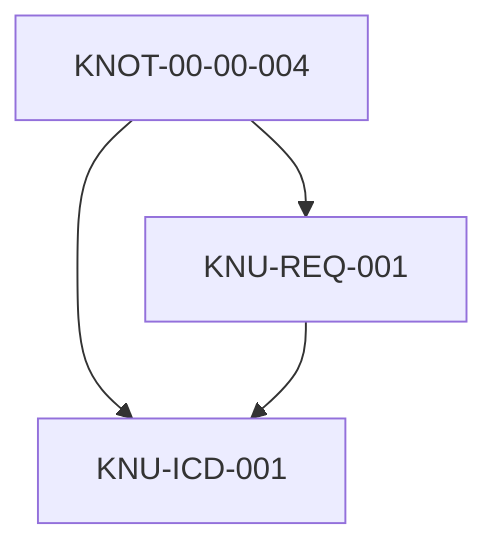

# KNU-00-00-004-REQ-001 — Cross-Reference System Requirements

**KNU ID:** KNU-00-00-004-REQ-001  
**KNOT Reference:** [KNOT-00-00-004](../LC01_PROBLEM_STATEMENT/README.md#knot-00-00-004) — Cross-Reference System Design  
**Artifact Class:** SSOT  
**KNU Type:** REQ  
**Version:** I01-R01  
**Status:** DRAFT  
**Owner:** STK_DATA  
**Due Date:** 2026-04-15  
**Effort Predicted:** 8 story points  

---

## 1. Purpose

This document defines the **requirements for the cross-reference and traceability system** enabling navigation from requirements through certification evidence across the AMPEL360 Q100 program. The system must support both human navigation and automated validation while maintaining the "human-readable first" principle.

### 1.1 Scope

| In-Scope | Out-of-Scope |
|----------|--------------|
| Reference URI syntax and semantics | Tooling implementation details |
| Trace link types and classification | Database schema (covered by ICD) |
| Bidirectional traceability requirements | CI pipeline configuration |
| Certification evidence linkage | Specific artifact content |
| Trace matrix structure | Approval workflow automation |
| Validation rules for link integrity | Third-party tool integration |
| Human-readable navigation patterns | — |

### 1.2 Design Principles

The cross-reference system shall adhere to these principles established in [KNOT-00-00-004](../LC01_PROBLEM_STATEMENT/README.md#knot-00-00-004):

| Principle | Description |
|-----------|-------------|
| **Human-Readable First** | References navigable without tooling; automation accelerates, not enables |
| **Bidirectional** | Every link shall be traversable in both directions |
| **Complete** | No orphan artifacts; all items traceable to source |
| **Verifiable** | Links machine-checkable for integrity |
| **Certification-Ready** | Supports DO-178C/DO-254 and CS-25 evidence chains |

---

## 2. Applicable Documents

### 2.1 Governing Documents

| Document | Applicability |
|----------|---------------|
| DO-178C | Software traceability requirements |
| DO-254 | Hardware traceability requirements |
| ARP4754A | System development traceability |
| EASA CS-25.1309 | Safety assessment evidence |
| S1000D Issue 5.0 | Publication cross-references |

### 2.2 Reference Documents

| Document | Applicability |
|----------|---------------|
| [KNU-00-00-002-REQ-001](./KNU-00-00-002-REQ-001_document-numbering-requirements.md) | ID grammar and URI syntax foundations |
| [KNOT-00-00-001](../LC01_PROBLEM_STATEMENT/README.md#knot-00-00-001) | Terminology for trace concepts |
| OPT-IN Framework Standard | Axis and lifecycle definitions |
| RFC 3986 | URI syntax standard |

---

## 3. Requirements

### 3.1 Reference Syntax Requirements

#### REQ-AMPEL-00-00-04-SE-001: URI Scheme Definition
**Old ID:** REQ-XRF-001
**Requirement:** The program shall define a URI scheme for internal references following the pattern:

```
ampel360://<axis>/<ata-path>/<lc-or-pub>/<artifact-id>[#<anchor>]
```

| Component | Description | Example |
|-----------|-------------|---------|
| `ampel360://` | Scheme identifier | `ampel360://` |
| `<axis>` | OPT-IN axis code | `T`, `O`, `P`, `I`, `N` |
| `<ata-path>` | ATA chapter/section/subject | `28/10/00` |
| `<lc-or-pub>` | Lifecycle category or PUB | `LC02`, `LC03`, `PUB/AMM` |
| `<artifact-id>` | KNU ID or file identifier | `KNU-28-10-001-REQ-001` |
| `#<anchor>` | Optional section anchor | `#req-fuel-001` |

**Full Example:** `ampel360://T/28/10/00/LC02/KNU-28-10-001-REQ-001#req-fuel-001`

| Attribute | Value |
|-----------|-------|
| Priority | MUST |
| Rationale | Enables unambiguous program-wide references |
| Verification | Inspection |
| Parent | KNOT-00-00-004 |

#### REQ-AMPEL-00-00-04-SE-002:
**Old ID:** REQ-XRF-002   Relative Path References
**Requirement:** Within the repository, references shall use relative paths from the referencing document:

```markdown
[Link Text](../relative/path/to/artifact.md)
[Link Text](../relative/path/to/artifact.md#section-anchor)
```

| Attribute | Value |
|-----------|-------|
| Priority | MUST |
| Rationale | Portable references; repository-relocatable |
| Verification | Inspection |
| Parent | KNOT-00-00-004 |

#### REQ-AMPEL-00-00-04-SE-003:
**Old ID:** REQ-XRF-003   Anchor Syntax
**Requirement:** Section anchors shall follow the pattern:

```
#<type>-<identifier>
```

| Type Prefix | Usage | Example |
|-------------|-------|---------|
| `req-` | Requirement | `#req-xrf-001` |
| `knot-` | KNOT reference | `#knot-00-00-004` |
| `knu-` | KNU reference | `#knu-00-00-004-req-001` |
| `sec-` | Section heading | `#sec-31-general` |
| `fig-` | Figure | `#fig-fuel-schematic` |
| `tbl-` | Table | `#tbl-trace-matrix` |

| Attribute | Value |
|-----------|-------|
| Priority | MUST |
| Rationale | Typed anchors enable semantic navigation |
| Verification | Inspection |
| Parent | KNOT-00-00-004 |

#### REQ-AMPEL-00-00-04-SE-004:
**Old ID:** REQ-XRF-004   External Reference Format
**Requirement:** References to external documents shall use the format:

```
[DOC-ID] Version, Section/Clause
```

**Examples:**
- `[SAE ARP4754A] Rev B, §5.2.1`
- `[EASA CS-25] Amdt 27, 25.1309(b)`
- `[ISO 7010] 2019, W021`

| Attribute | Value |
|-----------|-------|
| Priority | MUST |
| Rationale | Precise external traceability for certification |
| Verification | Review |
| Parent | KNOT-00-00-004 |

---

### 3.2 Trace Link Types

#### REQ-AMPEL-00-00-04-SE-010:
**Old ID:** REQ-XRF-010   Trace Link Classification
**Requirement:** The program shall classify trace links into the following types:

| Link Type | Code | Semantics | Example |
|-----------|------|-----------|---------|
| **Derives From** | `DERIVES` | Child derived from parent | REQ → KNOT |
| **Satisfies** | `SATISFIES` | Implementation satisfies requirement | ICD → REQ |
| **Verifies** | `VERIFIES` | Test/analysis verifies requirement | TST → REQ |
| **Allocates To** | `ALLOCATES` | Requirement allocated to component | SYS-REQ → HW/SW-REQ |
| **Refines** | `REFINES` | Lower-level refinement | Detail-REQ → High-REQ |
| **Depends On** | `DEPENDS` | Dependency relationship | KNOT → KNOT |
| **References** | `REFS` | Informational reference | Any → Any |
| **Supersedes** | `SUPERSEDES` | Replaces previous version | New → Old |
| **Conflicts With** | `CONFLICTS` | Identified conflict (requires resolution) | REQ → REQ |

| Attribute | Value |
|-----------|-------|
| Priority | MUST |
| Rationale | Semantic links enable trace analysis and impact assessment |
| Verification | Review |
| Parent | KNOT-00-00-004 |

#### REQ-AMPEL-00-00-04-SE-011:
**Old ID:** REQ-XRF-011   Bidirectional Link Requirement
**Requirement:** Every trace link shall be navigable in both directions:
- Forward: Source → Target
- Backward: Target → Source

The system shall maintain inverse relationships automatically or through documented conventions.

| Attribute | Value |
|-----------|-------|
| Priority | MUST |
| Rationale | Complete traceability requires both upstream and downstream navigation |
| Verification | Inspection |
| Parent | KNOT-00-00-004 |

#### REQ-AMPEL-00-00-04-SE-012:
**Old ID:** REQ-XRF-012   Link Cardinality
**Requirement:** Trace links shall support the following cardinalities:

| Cardinality | Description | Validation |
|-------------|-------------|------------|
| 1:1 | One source to one target | Strict |
| 1:N | One source to many targets | Allowed |
| N:1 | Many sources to one target | Allowed |
| N:M | Many-to-many | Requires justification |

| Attribute | Value |
|-----------|-------|
| Priority | MUST |
| Rationale | Defines valid relationship patterns |
| Verification | Review |
| Parent | KNOT-00-00-004 |

---

### 3.3 Certification Traceability Requirements

#### REQ-AMPEL-00-00-04-SE-020:
**Old ID:** REQ-XRF-020   Certification Evidence Chain
**Requirement:** The traceability system shall support the certification evidence chain:

```
Regulation/Means of Compliance
    ↓ [DERIVES]
System Requirements (LC02)
    ↓ [ALLOCATES]
HW/SW Requirements
    ↓ [SATISFIES]
Design (LC04)
    ↓ [VERIFIES]
Analysis/Test (LC05/LC06)
    ↓ [DOCUMENTS]
Certification Evidence Package
```

| Attribute | Value |
|-----------|-------|
| Priority | MUST |
| Rationale | DO-178C/DO-254 and ARP4754A traceability requirements |
| Verification | Review |
| Parent | KNOT-00-00-004 |

#### REQ-AMPEL-00-00-04-SE-021:
**Old ID:** REQ-XRF-021   Means of Compliance Mapping
**Requirement:** Each certification requirement (CS-25, Part 25) shall trace to:
- Means of Compliance (MOC) method
- Responsible ATA chapter(s)
- Evidence artifact(s)
- Compliance status

| Attribute | Value |
|-----------|-------|
| Priority | MUST |
| Rationale | Required for Type Certificate application |
| Verification | Review |
| Parent | KNOT-00-00-004 |

#### REQ-AMPEL-00-00-04-SE-022:
**Old ID:** REQ-XRF-022   Safety Assessment Traceability
**Requirement:** Safety-derived requirements (from FHA, PSSA, SSA per ARP4761) shall trace to:
- Source hazard/failure condition
- Safety objective (probability target)
- DAL allocation
- Verification evidence

| Attribute | Value |
|-----------|-------|
| Priority | MUST |
| Rationale | CS-25.1309 safety assessment evidence |
| Verification | Review |
| Parent | KNOT-00-00-004 |

#### REQ-AMPEL-00-00-04-SE-023:
**Old ID:** REQ-XRF-023   Software Traceability (DO-178C)
**Requirement:** For DAL A/B/C software, traceability shall include:

| Trace Path | DO-178C Table | Required For |
|------------|---------------|--------------|
| System Req → HLR | A-3 | DAL A, B, C |
| HLR → LLR | A-4 | DAL A, B |
| LLR → Source Code | A-5 | DAL A, B |
| HLR → Test Cases | A-6 | DAL A, B, C |
| LLR → Test Cases | A-7 | DAL A, B |

| Attribute | Value |
|-----------|-------|
| Priority | MUST |
| Rationale | DO-178C objectives |
| Verification | Review |
| Parent | KNOT-00-00-004 |

#### REQ-AMPEL-00-00-04-SE-024:
**Old ID:** REQ-XRF-024   Hardware Traceability (DO-254)
**Requirement:** For DAL A/B hardware, traceability shall include:

| Trace Path | Required For |
|------------|--------------|
| System Req → HW Req | DAL A, B |
| HW Req → Design | DAL A, B |
| Design → Verification | DAL A, B |

| Attribute | Value |
|-----------|-------|
| Priority | MUST |
| Rationale | DO-254 objectives |
| Verification | Review |
| Parent | KNOT-00-00-004 |

---

### 3.4 Trace Matrix Requirements

#### REQ-AMPEL-00-00-04-SE-030:
**Old ID:** REQ-XRF-030   Trace Matrix Structure
**Requirement:** Each ATA section shall maintain a trace matrix with the following structure:

| Column | Description |
|--------|-------------|
| Source ID | Originating artifact ID |
| Source Title | Artifact title/description |
| Link Type | Trace link classification |
| Target ID | Destination artifact ID |
| Target Title | Artifact title/description |
| Status | VALID / SUSPECT / BROKEN |
| Verification | Method and evidence reference |
| Last Verified | Date of last integrity check |

| Attribute | Value |
|-----------|-------|
| Priority | MUST |
| Rationale | Standardized matrix format enables automation |
| Verification | Inspection |
| Parent | KNOT-00-00-004 |

#### REQ-AMPEL-00-00-04-SE-031:
**Old ID:** REQ-XRF-031   Trace Matrix Location
**Requirement:** Trace matrices shall be located at:
- Section level: `xx-yy-zz/SSOT/TRACE_MATRIX.csv`
- Chapter level: `ATA_XX/TRACE_MATRIX.csv` (consolidated)
- Program level: `OPT-IN_FRAMEWORK/MASTER_TRACE_MATRIX.csv`

| Attribute | Value |
|-----------|-------|
| Priority | MUST |
| Rationale | Predictable locations for navigation and automation |
| Verification | Inspection |
| Parent | KNOT-00-00-004 |

#### REQ-AMPEL-00-00-04-SE-032:
**Old ID:** REQ-XRF-032   Coverage Metrics
**Requirement:** Trace matrices shall support calculation of:

| Metric | Definition |
|--------|------------|
| **Forward Coverage** | % of source items with at least one downstream link |
| **Backward Coverage** | % of target items with at least one upstream link |
| **Verification Coverage** | % of requirements with verification evidence |
| **Orphan Count** | Items with no incoming or outgoing links |
| **Suspect Link Count** | Links marked SUSPECT requiring review |

| Attribute | Value |
|-----------|-------|
| Priority | MUST |
| Rationale | Certification evidence completeness metrics |
| Verification | Inspection |
| Parent | KNOT-00-00-004 |

---

### 3.5 KNOT/KNU Traceability

#### REQ-AMPEL-00-00-04-SE-040:
**Old ID:** REQ-XRF-040   KNOT-to-KNU Traceability
**Requirement:** Every KNU shall trace to exactly one parent KNOT via the `DERIVES` link type:

```
KNOT-XX-YY-ZZ-NNN
    ↓ [DERIVES]
    ├── KNU-XX-YY-NNN-REQ-001
    ├── KNU-XX-YY-NNN-ICD-001
    ├── KNU-XX-YY-NNN-ANA-001
    └── KNU-XX-YY-NNN-PUB-001
```

| Attribute | Value |
|-----------|-------|
| Priority | MUST |
| Rationale | Maintains uncertainty-to-resolution traceability |
| Verification | Inspection |
| Parent | KNOT-00-00-004 |

#### REQ-AMPEL-00-00-04-SE-041:
**Old ID:** REQ-XRF-041   KNU Cross-References
**Requirement:** KNUs may reference other KNUs via:
- `DEPENDS` — Required input from another KNU
- `REFS` — Informational reference
- `REFINES` — Lower-level detail of another KNU

| Attribute | Value |
|-----------|-------|
| Priority | MUST |
| Rationale | Captures inter-artifact dependencies |
| Verification | Review |
| Parent | KNOT-00-00-004 |

#### REQ-AMPEL-00-00-04-SE-042:
**Old ID:** REQ-XRF-042   KNOT Spillover Traceability
**Requirement:** KNUs that contribute to multiple KNOTs (spillover effect) shall document:
- Primary KNOT (parent)
- Adjacent KNOTs (spillover targets)
- Spillover weight (per TOKENOMICS_TT.yaml adjacency matrix)

| Attribute | Value |
|-----------|-------|
| Priority | SHOULD |
| Rationale | Supports tokenomics impact calculation |
| Verification | Review |
| Parent | KNOT-00-00-004 |

---

### 3.6 Lifecycle Traceability

#### REQ-AMPEL-00-00-04-SE-050:
**Old ID:** REQ-XRF-050   LC Category Trace Flow
**Requirement:** The traceability system shall enforce the standard lifecycle trace flow:

```
LC01 (Problem)
 ↓ [DERIVES]
LC02 (Requirements)
 ↓ [ALLOCATES]
LC03 (Safety) ←→ LC04 (Design)
 ↓               ↓
LC05 (Analysis)  LC06 (Verification)
 ↓               ↓
LC07 (Validation)
 ↓
LC08 (Configuration) → PUB (Publications)
```

| Attribute | Value |
|-----------|-------|
| Priority | MUST |
| Rationale | Enforces standard V-model traceability |
| Verification | Review |
| Parent | KNOT-00-00-004 |

#### REQ-AMPEL-00-00-04-SE-051:
**Old ID:** REQ-XRF-051   Cross-LC Traceability
**Requirement:** Artifacts in different lifecycle categories shall maintain explicit trace links:

| From LC | To LC | Link Type | Purpose |
|---------|-------|-----------|---------|
| LC01 | LC02 | DERIVES | Problem → Requirement |
| LC02 | LC03 | ALLOCATES | Requirement → Safety Analysis |
| LC02 | LC04 | SATISFIES | Requirement → Design |
| LC02 | LC06 | VERIFIES | Requirement → Test |
| LC04 | LC05 | VERIFIES | Design → Analysis |
| LC06 | LC07 | VALIDATES | Test → Validation |
| LC08 | PUB | PUBLISHES | Config → Publication |

| Attribute | Value |
|-----------|-------|
| Priority | MUST |
| Rationale | Cross-LC dependencies critical for impact analysis |
| Verification | Review |
| Parent | KNOT-00-00-004 |

---

### 3.7 Publication Traceability

#### REQ-AMPEL-00-00-04-SE-060:
**Old ID:** REQ-XRF-060   SSOT-to-PUB Traceability
**Requirement:** Every S1000D Data Module (DM) in the CSDB shall trace to its source SSOT artifact(s):

```xml
<!-- In DM metadata or COMMON -->
<sourceRef>
  <ssotRef uri="ampel360://T/28/10/00/LC04/KNU-28-10-001-ICD-001"/>
</sourceRef>
```

| Attribute | Value |
|-----------|-------|
| Priority | MUST |
| Rationale | Maintains single-source-of-truth integrity |
| Verification | BREX+CI |
| Parent | KNOT-00-00-004 |

#### REQ-AMPEL-00-00-04-SE-061:
**Old ID:** REQ-XRF-061   DM Cross-References
**Requirement:** S1000D Data Modules shall use `<dmRef>` elements for internal cross-references following the program DMC conventions:

```xml
<dmRef>
  <dmRefIdent>
    <dmCode modelIdentCode="AMPEL" 
            systemDiffCode="A" 
            systemCode="28" 
            subSystemCode="1" 
            subSubSystemCode="0"
            assyCode="00" 
            disassyCode="00" 
            disassyCodeVariant="A"
            infoCode="040" 
            infoCodeVariant="A" 
            itemLocationCode="A"/>
  </dmRefIdent>
</dmRef>
```

| Attribute | Value |
|-----------|-------|
| Priority | MUST |
| Rationale | S1000D standard cross-reference mechanism |
| Verification | BREX+CI |
| Parent | KNOT-00-00-004 |

#### REQ-AMPEL-00-00-04-SE-062:
**Old ID:** REQ-XRF-062   Applicability Traceability
**Requirement:** Publication applicability (ACT/PCT/CCT) shall trace to configuration effectivity in LC08:

| Applicability Type | Source |
|--------------------|--------|
| Aircraft (ACT) | LC08 aircraft configuration baseline |
| Product (PCT) | LC08 product definition |
| Condition (CCT) | LC08 operational conditions |

| Attribute | Value |
|-----------|-------|
| Priority | MUST |
| Rationale | Ensures publication applicability matches configuration |
| Verification | Review |
| Parent | KNOT-00-00-004 |

---

### 3.8 Validation and Integrity Requirements

#### REQ-AMPEL-00-00-04-SE-070:
**Old ID:** REQ-XRF-070   Link Integrity Validation
**Requirement:** The CI pipeline shall validate link integrity by checking:

| Check | Description | Severity |
|-------|-------------|----------|
| Target Exists | Referenced artifact exists | ERROR |
| Anchor Exists | Referenced anchor exists in target | ERROR |
| Bidirectional | Inverse link exists | WARNING |
| Type Valid | Link type is valid for source/target pair | WARNING |
| Not Circular | No circular reference chains | ERROR |

| Attribute | Value |
|-----------|-------|
| Priority | MUST |
| Rationale | Automated quality assurance |
| Verification | Test |
| Parent | KNOT-00-00-004 |

#### REQ-AMPEL-00-00-04-SE-071:
**Old ID:** REQ-XRF-071   Suspect Link Management
**Requirement:** When a referenced artifact changes, all incoming links shall be marked SUSPECT until reviewed:

| Trigger | Action |
|---------|--------|
| Target content change | Mark incoming links SUSPECT |
| Target ID change | Mark incoming links BROKEN |
| Target deletion | Mark incoming links BROKEN |
| Review complete | Mark links VALID with timestamp |

| Attribute | Value |
|-----------|-------|
| Priority | MUST |
| Rationale | Change impact visibility |
| Verification | Review |
| Parent | KNOT-00-00-004 |

#### REQ-AMPEL-00-00-04-SE-072:
**Old ID:** REQ-XRF-072   Orphan Detection
**Requirement:** The system shall detect and report orphan artifacts:

| Orphan Type | Definition | Action |
|-------------|------------|--------|
| **Upstream Orphan** | No incoming links (no source) | Review for validity |
| **Downstream Orphan** | No outgoing links (not used) | Review for completeness |
| **Complete Orphan** | No links in either direction | Likely error; investigate |

| Attribute | Value |
|-----------|-------|
| Priority | MUST |
| Rationale | Completeness verification |
| Verification | Inspection |
| Parent | KNOT-00-00-004 |

#### REQ-AMPEL-00-00-04-SE-073:
**Old ID:** REQ-XRF-073   Coverage Thresholds
**Requirement:** The following coverage thresholds shall be enforced:

| Metric | Minimum | Gate |
|--------|---------|------|
| Requirement → Design | 100% | Milestone |
| Requirement → Verification | 100% | Certification |
| Safety Req → Analysis | 100% | Safety Review |
| KNOT → KNU | 100% | KNOT Closure |

| Attribute | Value |
|-----------|-------|
| Priority | MUST |
| Rationale | Certification completeness |
| Verification | Inspection |
| Parent | KNOT-00-00-004 |

---

### 3.9 Human-Readable Navigation

#### REQ-AMPEL-00-00-04-SE-080:
**Old ID:** REQ-XRF-080   README Navigation Links
**Requirement:** Every README.md shall include navigation links to:
- Parent folder/section
- Sibling sections
- Key downstream artifacts
- Related cross-axis content

| Attribute | Value |
|-----------|-------|
| Priority | MUST |
| Rationale | Human navigation without tooling |
| Verification | Inspection |
| Parent | KNOT-00-00-004 |

#### REQ-AMPEL-00-00-04-SE-081:
**Old ID:** REQ-XRF-081   Index Files
**Requirement:** Each axis and chapter shall maintain an `00_INDEX.md` file with:
- Quick-reference tables
- Hyperlinked artifact lists
- Status summaries
- Navigation to related axes/chapters

| Attribute | Value |
|-----------|-------|
| Priority | MUST |
| Rationale | Entry points for human navigation |
| Verification | Inspection |
| Parent | KNOT-00-00-004 |

#### REQ-AMPEL-00-00-04-SE-082:
**Old ID:** REQ-XRF-082   Mermaid Diagrams
**Requirement:** Complex trace relationships should be visualized using Mermaid diagrams embedded in README files:

```markdown

```

| Attribute | Value |
|-----------|-------|
| Priority | SHOULD |
| Rationale | Visual navigation aids comprehension |
| Verification | Inspection |
| Parent | KNOT-00-00-004 |

#### REQ-AMPEL-00-00-04-SE-083:
**Old ID:** REQ-XRF-083   Breadcrumb Convention
**Requirement:** Document headers shall include breadcrumb navigation:

```markdown
**Path:** [OPT-IN](/) → [T-TECHNOLOGIES](/T/) → [ATA 28](/T/ATA_28/) → [LC02](/T/ATA_28/LC02/) → This Document
```

| Attribute | Value |
|-----------|-------|
| Priority | SHOULD |
| Rationale | Location awareness in deep hierarchies |
| Verification | Inspection |
| Parent | KNOT-00-00-004 |

---

### 3.10 Automation Support Requirements

#### REQ-AMPEL-00-00-04-SE-090:
**Old ID:** REQ-XRF-090   Machine-Readable Link Format
**Requirement:** In addition to Markdown links, a machine-readable link registry shall be maintained in CSV or YAML format:

```yaml
links:
  - source: "KNU-00-00-004-REQ-001"
    target: "KNOT-00-00-004"
    type: "DERIVES"
    status: "VALID"
    verified: "2026-01-12"
```

| Attribute | Value |
|-----------|-------|
| Priority | SHOULD |
| Rationale | Enables automated trace analysis |
| Verification | Inspection |
| Parent | KNOT-00-00-004 |

#### REQ-AMPEL-00-00-04-SE-091:
**Old ID:** REQ-XRF-091   CI Validation Workflow
**Requirement:** The CI pipeline shall include a link validation step that:
- Parses all Markdown links
- Validates target existence
- Reports broken/suspect links
- Fails build on ERROR-level issues
- Generates coverage report

| Attribute | Value |
|-----------|-------|
| Priority | MUST |
| Rationale | Continuous integrity assurance |
| Verification | Test |
| Parent | KNOT-00-00-004 |

#### REQ-AMPEL-00-00-04-SE-092:
**Old ID:** REQ-XRF-092   Impact Analysis Support
**Requirement:** The traceability system shall support impact analysis queries:
- "What depends on artifact X?"
- "What does artifact X depend on?"
- "What is affected if X changes?"
- "What is the certification evidence chain for requirement Y?"

| Attribute | Value |
|-----------|-------|
| Priority | SHOULD |
| Rationale | Change management and certification support |
| Verification | Demonstration |
| Parent | KNOT-00-00-004 |

---

## 4. Requirements Summary

### 4.1 Requirements Count

| Category | MUST | SHOULD | MAY | Total |
|----------|------|--------|-----|-------|
| Reference Syntax | 4 | 0 | 0 | 4 |
| Trace Link Types | 3 | 0 | 0 | 3 |
| Certification | 5 | 0 | 0 | 5 |
| Trace Matrix | 3 | 0 | 0 | 3 |
| KNOT/KNU | 2 | 1 | 0 | 3 |
| Lifecycle | 2 | 0 | 0 | 2 |
| Publication | 3 | 0 | 0 | 3 |
| Validation | 4 | 0 | 0 | 4 |
| Human-Readable | 2 | 2 | 0 | 4 |
| Automation | 1 | 2 | 0 | 3 |
| **Total** | **29** | **5** | **0** | **34** |

### 4.2 Link Type Summary

| Code | Forward | Inverse | Usage |
|------|---------|---------|-------|
| DERIVES | Parent → Child | Child ← Parent | KNOT → KNU, Reg → Req |
| SATISFIES | Impl → Req | Req ← Impl | Design → Requirement |
| VERIFIES | Evidence → Req | Req ← Evidence | Test → Requirement |
| ALLOCATES | High → Low | Low ← High | System → Component |
| REFINES | Detail → High | High ← Detail | Detailed → Summary |
| DEPENDS | A → B | B ← A | Dependency |
| REFS | A → B | — | Informational |
| SUPERSEDES | New → Old | Old ← New | Version replacement |
| CONFLICTS | A ↔ B | B ↔ A | Conflict (bidirectional) |

---

## 5. Traceability

### 5.1 Upstream Traceability

| Source | Trace |
|--------|-------|
| KNOT-00-00-004 | Problem statement: cross-reference system design |
| KNU-00-00-002-REQ-001 | ID grammar and basic URI syntax (REQ-DOC-070–072) |
| DO-178C | Software traceability objectives |
| DO-254 | Hardware traceability objectives |
| ARP4754A | System development traceability |

### 5.2 Downstream Traceability

| Target | Trace |
|--------|-------|
| KNU-00-00-004-ICD-001 | Reference Syntax Specification |
| KNU-00-00-004-ANA-001 | Traceability Matrix Template |
| KNU-00-00-004-CM-001 | Reference Integrity Check Process |
| KNU-00-00-004-PUB-001 | Cross-Reference Guide DM |
| All LC02 artifacts | Apply trace link requirements |
| All LC06 artifacts | Verification traceability |

---

## 6. Verification Matrix

| REQ ID | Method | Responsible | Evidence |
|--------|--------|-------------|----------|
| REQ-AMPEL-00-00-04-SE-001-004 | Inspection | STK_DATA | Syntax specification |
| REQ-AMPEL-00-00-04-SE-010-012 | Review | STK_DATA | Link type registry |
| REQ-AMPEL-00-00-04-SE-020-024 | Review | STK_CERT | Certification mapping |
| REQ-AMPEL-00-00-04-SE-030-032 | Inspection | STK_DATA | Matrix templates |
| REQ-AMPEL-00-00-04-SE-040-042 | Inspection | STK_CM | KNOT/KNU links |
| REQ-AMPEL-00-00-04-SE-050-051 | Review | STK_SE | LC flow validation |
| REQ-AMPEL-00-00-04-SE-060-062 | BREX+CI | STK_PUB | DM references |
| REQ-AMPEL-00-00-04-SE-070-073 | Test | STK_DATA | CI validation |
| REQ-AMPEL-00-00-04-SE-080-083 | Inspection | STK_CM | README review |
| REQ-AMPEL-00-00-04-SE-090-092 | Demonstration | STK_DATA | Automation demo |

---

## 7. Open Items

### 7.1 TBDs

| TBD ID | Description | Owner | Target Date |
|--------|-------------|-------|-------------|
| TBD-XRF-001 | Final URI scheme registration (if external use needed) | STK_DATA | 2026-03-15 |
| TBD-XRF-002 | CI tool selection for link validation | STK_DATA | 2026-03-30 |

### 7.2 TBRs

| TBR ID | Description | Owner | Target Date |
|--------|-------------|-------|-------------|
| TBR-XRF-001 | Review coverage thresholds with certification authority | STK_CERT | 2026-04-01 |

---

## 8. Revision History

| Version | Date | Author | Changes |
|---------|------|--------|---------|
| I01-R01 | 2026-01-12 | STK_DATA | Initial release |

---

*This document is part of the AMPEL360 Q100 SSOT baseline under the OPT-IN Framework.*

*KNU-00-00-004-REQ-001 defines cross-reference system requirements addressing KNOT-00-00-004.*
