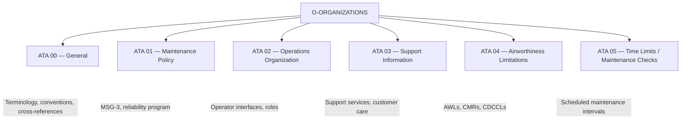
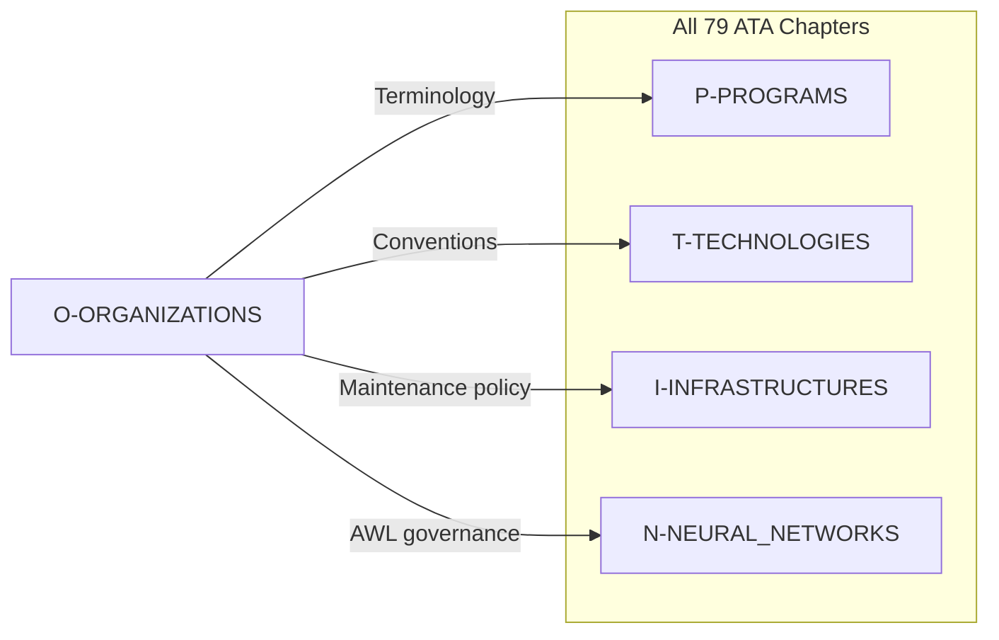

# O — Organizations

**OPT-IN Axis:** O (Organizations)  
**Full Path:** `OPT-IN_FRAMEWORK/O-ORGANIZATIONS/`  
**Scope:** Program-wide policies, maintenance organization, airworthiness management  
**ATA Coverage:** ATA 00–05  

---

## 1. Overview

The **O-ORGANIZATIONS** axis contains foundational documentation governing the AMPEL360 Q100 program organization, maintenance policies, and airworthiness management. These chapters establish conventions and policies referenced by all other OPT-IN axes.



### 1.1 Axis Purpose

| Function | Description |
|----------|-------------|
| **Program Conventions** | Terminology, document architecture, unit systems |
| **Maintenance Strategy** | MSG-3 process, reliability-centered maintenance |
| **Operational Framework** | Operator/OEM interfaces, support organization |
| **Airworthiness Control** | Limitations, inspections, mandatory actions |
| **Scheduling** | Maintenance intervals, task allocation |

### 1.2 Q100-Specific Considerations

The O-axis for Q100 addresses novel organizational challenges:

| Challenge | Response |
|-----------|----------|
| H₂ infrastructure coordination | Operator–airport–fuel supplier interfaces |
| Novel system maintenance | MSG-3 adaptation for fuel cells, cryogenic systems |
| AI/ML system governance | Maintenance policy for learning systems |
| DPP integration | Airworthiness tracking via Digital Product Passport |
| Circularity requirements | End-of-life considerations in maintenance policy |

---

## 2. Chapter Index

| ATA | Title | Scope | Status |
|-----|-------|-------|--------|
| [00](./ATA_00-GENERAL/) | General | Terminology, conventions, cross-references | ACTIVE |
| [01](./ATA_01-MAINTENANCE_POLICY/) | Maintenance Policy | MSG-3, reliability program, policy documents | PLANNED |
| [02](./ATA_02-OPERATIONS_ORG/) | Operations Organization | Operator interfaces, organizational roles | PLANNED |
| [03](./ATA_03-SUPPORT_INFORMATION/) | Support Information | Customer support, technical services | PLANNED |
| [04](./ATA_04-AIRWORTHINESS_LIMITATIONS/) | Airworthiness Limitations | AWLs, CMRs, CDCCLs | PLANNED |
| [05](./ATA_05-TIME_LIMITS_MAINT_CHECKS/) | Time Limits / Maintenance Checks | Scheduled intervals, check packages | PLANNED |

---

## 3. Key Documents

### 3.1 ATA 00 — General

Establishes program-wide conventions:

| Document Type | Content |
|---------------|---------|
| **Program Glossary** | Standardized terminology for Q100 concepts |
| **Document Architecture Guide** | Numbering, versioning, folder structure |
| **Safety Labeling Standard** | Warning/caution/note conventions, H₂ symbols |
| **Cross-Reference System** | Traceability architecture, URI syntax |
| **Unit Conversion Tables** | SI/imperial conventions, H₂-specific units |

### 3.2 ATA 01 — Maintenance Policy

Defines maintenance strategy:

| Document Type | Content |
|---------------|---------|
| **Maintenance Program Development** | MSG-3 process adaptation for Q100 |
| **Reliability Program** | Data collection, trend analysis |
| **Maintenance Philosophy** | Preventive vs. condition-based strategy |
| **H₂ System Maintenance Policy** | Cryogenic system inspection philosophy |
| **AI/ML Maintenance Policy** | Model update and monitoring procedures |

### 3.3 ATA 04 — Airworthiness Limitations

Mandatory compliance items:

| Document Type | Content |
|---------------|---------|
| **Airworthiness Limitations Section (ALS)** | Mandatory inspections and limits |
| **Certification Maintenance Requirements (CMR)** | Safety-derived tasks |
| **Critical Design Configuration Control Limitations (CDCCL)** | Design-critical items |
| **Fuel System CDCCL** | H₂ system-specific limitations |
| **Neural System Limitations** | AI/ML monitoring requirements |

---

## 4. Dependencies

### 4.1 Downstream Impact

O-axis chapters are referenced by all other axes:



### 4.2 Upstream Dependencies

| Source | Dependency |
|--------|------------|
| Regulatory Authorities | CS-25/Part 25 terminology requirements |
| S1000D Business Rules | BREX constraints |
| Industry Standards | ATA iSpec 2200, MSG-3, ARP4761 |

---

## 5. Folder Structure

```
O-ORGANIZATIONS/
├── README.md                    # This file
├── 00_INDEX.md                  # Quick reference index
│
├── ATA_00-GENERAL/
│   └── ATA-00-general/
│       ├── 00-00-general/
│       │   ├── README.md
│       │   ├── SSOT/
│       │   │   ├── LC01_PROBLEM_STATEMENT/
│       │   │   ├── LC02_SYSTEM_REQUIREMENTS/
│       │   │   └── ...
│       │   └── PUB/
│       │       └── AMM/
│       └── 00-90-tables-schemas-index/
│
├── ATA_01-MAINTENANCE_POLICY/
│   └── ATA-01-maintenance-policy/
│       ├── 01-00-general/
│       └── ...
│
├── ATA_02-OPERATIONS_ORG/
│   └── ATA-02-operations-organization/
│       └── ...
│
├── ATA_03-SUPPORT_INFORMATION/
│   └── ATA-03-support-information/
│       └── ...
│
├── ATA_04-AIRWORTHINESS_LIMITATIONS/
│   └── ATA-04-airworthiness-limitations/
│       └── ...
│
└── ATA_05-TIME_LIMITS_MAINT_CHECKS/
    └── ATA-05-time-limits-maintenance-checks/
        └── ...
```

---

## 6. Stakeholder Ownership

| ATA | Primary STK | Secondary STK |
|-----|-------------|---------------|
| 00 | STK_CM | STK_SE |
| 01 | STK_MRO | STK_SAF |
| 02 | STK_OPS | STK_SE |
| 03 | STK_MRO | STK_OPS |
| 04 | STK_CERT | STK_SAF |
| 05 | STK_MRO | STK_OPS |

---

## 7. Related Axes

| Axis | Relationship |
|------|--------------|
| [P — Programs](../P-PROGRAMS/) | Ground handling procedures use O-axis policies |
| [T — Technologies](../T-TECHNOLOGIES_AMEDEOPELLICCIA-ON_BOARD_SYSTEMS/) | All systems reference O-axis conventions |
| [I — Infrastructures](../I-INFRASTRUCTURES/) | GSE maintenance uses O-axis policy |
| [N — Neural Networks](../N-NEURAL_NETWORKS/) | Governance references O-axis structure |

---

## 8. Active LC01 Nodes

| ATA | Section | KNOT Count | Status |
|-----|---------|------------|--------|
| [00-00](./ATA_00-GENERAL/ATA-00-general/00-00-general/SSOT/LC01_PROBLEM_STATEMENT/) | General | 5 | ACTIVE |

---

## 9. Revision History

| Date | Author | Change |
|------|--------|--------|
| 2026-01-11 | AMPEL360 Baseline Architect | Initial O-axis README |

---

*This document is part of the AMPEL360 Q100 SSOT baseline under the OPT-IN Framework.*

*O-ORGANIZATIONS establishes foundational policies and conventions for the entire program.*
