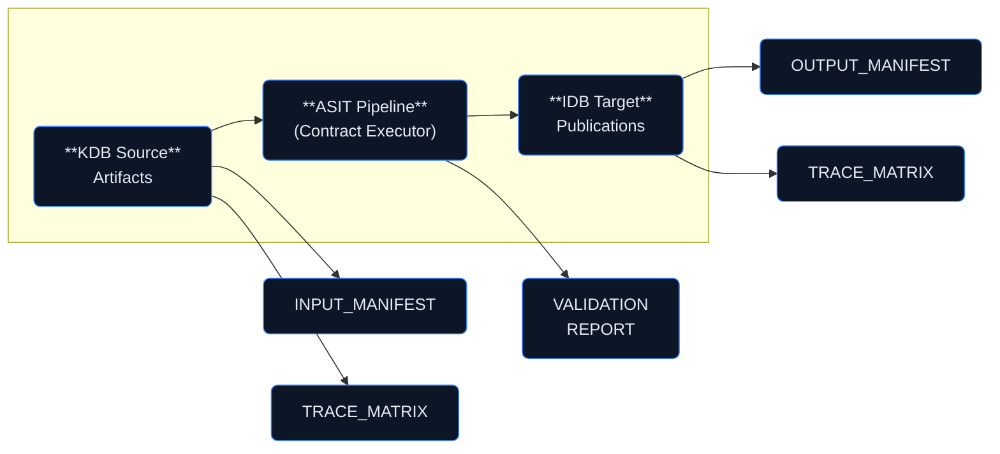

# CONTRACTS — KDB to IDB Transformation Governance
## ATA-28-10-00 Fuel Storage General

**Version:** 1.0.0  
**Status:** Active  
**Last Updated:** 2026-01-27

---

## Overview

The CONTRACTS folder contains the **contract-first governance** definitions that control how Knowledge Data Base (KDB) content is transformed into Information Data Base (IDB) publications.

Each contract defines:
- Input sources (KDB artifacts)
- Transformation rules
- Output targets (IDB publications)
- Validation requirements
- Audit/traceability requirements

---

## Available Contracts

| Contract | Source | Target | Description |
|----------|--------|--------|-------------|
| KITDM-CTR-LM-CSDB | KDB/LM/SSOT | IDB/PUB/AMM/CSDB | KDB to S1000D CSDB |
| KITDM-CTR-LM-EXPORT | IDB/PUB/CSDB | IDB/PUB/EXPORT | CSDB to PDF/HTML |
| KITDM-CTR-LM-IETP | IDB/PUB/CSDB | IDB/PUB/IETP | CSDB to Interactive viewer |
| KITDM-CTR-OPS-SB | OPS/LC12 | IDB/PUB/SB | Service Bulletin generation |

---

## Contract Execution Model

---

## Files

| File | Description |
|------|-------------|
| `KITDM-CTR-LM-CSDB_ATA28-10-00.yaml` | KDB→CSDB transformation contract |
| `KITDM-CTR-LM-EXPORT_ATA28-10-00.yaml` | CSDB→EXPORT rendering contract |
| `CONTRACT_APPROVAL_LOG.csv` | Contract approval history |
| `EVIDENCE/` | Contract validation evidence |

---

## Revision History

| Date | Version | Author | Change |
|------|---------|--------|--------|
| 2026-01-27 | 1.0.0 | STK_CM | Initial contracts structure |
