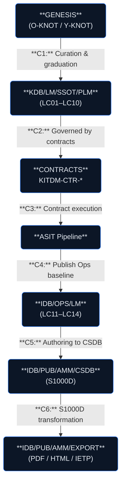

# ATA 28-10-00 — Fuel Storage General
## AMPEL360 Q100 LH₂ Cryogenic Storage System

**Subject ID:** ATA28-10-00  
**Version:** 1.0.0  
**Status:** Active Development  
**Last Updated:** 2026-01-27

---

## Overview

This subject folder contains the complete knowledge and information architecture for the **AMPEL360 Q100 Liquid Hydrogen (LH₂) Cryogenic Fuel Storage System**. It implements the full canonical ATA-XX schema with:

- **GENESIS** — Uncertainty discovery layer
- **KDB** — Knowledge Data Base (SSOT/PLM lifecycle artifacts)
- **CONTRACTS** — KDB→IDB transformation governance
- **ASIT** — Automated transformation pipeline
- **IDB** — Information Data Base (OPS + PUB deliverables)

---

## Quick Navigation

| Layer | Path | Description |
|-------|------|-------------|
| **KDB/DEV** | `KDB/DEV/` | Active development workspace (not baselined) |
| **KDB/SSOT** | `KDB/LM/SSOT/PLM/` | Baselined engineering artifacts (LC01-LC10) |
| **IDB/OPS** | `IDB/OPS/LM/` | Operational lifecycle artifacts (LC11-LC14) |
| **IDB/PUB** | `IDB/PUB/` | S1000D publications (AMM, IPC, SRM, CMM) |

---

## System Scope

### In Scope

✅ LH₂ cryogenic tank design and qualification  
✅ Multi-Layer Insulation (MLI) systems  
✅ Fill, drain, and vent interfaces  
✅ Pressure management and relief systems  
✅ Level, temperature, and pressure sensing  
✅ Tank safety case and certification  

### Out of Scope

❌ Fuel distribution network (see ATA 28-20)  
❌ Fuel delivery to power plant (see ATA 28-30)  
❌ Ground support equipment (see ATA 85)  

---

## Current Status

### KNOT Progress

| KNOT ID | Title | Status | Residual |
|---------|-------|--------|----------|
| KNOT-ATA28-10-00-001 | Cryogenic Tank Design | IN_PROGRESS | 65/10 |
| KNOT-ATA28-10-00-002 | Tank Safety Case | OPEN | 100/10 |
| KNOT-ATA28-10-00-003 | Insulation Performance | IN_PROGRESS | 70/15 |
| KNOT-ATA28-10-00-004 | Structural Qualification | OPEN | 100/10 |
| KNOT-ATA28-10-00-005 | Certification Strategy | IN_PROGRESS | 80/10 |

### Milestone Timeline

```
2026-Q3  ─────  PDR (Preliminary Design Review)
2027-Q1  ─────  CDR (Critical Design Review)
2027-Q4  ─────  TRR (Test Readiness Review)
2028-Q2  ─────  Qualification Complete
2029-Q4  ─────  Type Certification
```

---

## Key Documents

### LC01 Problem Statement
- [KNOTS.csv](KDB/LM/SSOT/PLM/LC01_PROBLEM_STATEMENT/KNOTS.csv) — Active uncertainty register
- [KNU_PLAN.csv](KDB/LM/SSOT/PLM/LC01_PROBLEM_STATEMENT/KNU_PLAN.csv) — Planned artifacts
- [TOKENOMICS_TT.yaml](KDB/LM/SSOT/PLM/LC01_PROBLEM_STATEMENT/TOKENOMICS_TT.yaml) — Token allocation

### LC02 Requirements
- [REQ-ATA28-10-00-001.md](KDB/LM/SSOT/PLM/LC02_SYSTEM_REQUIREMENTS/PACKAGES/REQ/REQ-ATA28-10-00-001.md) — System requirements

### Publications (IDB/PUB)
- [DMC-AMPEL360-28-10-00-00A-001A-A.md](IDB/PUB/AMM/CSDB/DM/DMC-AMPEL360-28-10-00-00A-001A-A.md) — System description
- [DMC-AMPEL360-28-10-00-00A-200A-A.md](IDB/PUB/AMM/CSDB/DM/DMC-AMPEL360-28-10-00-00A-200A-A.md) — Servicing procedure

---

## Traceability

### Pipeline Flow



### Source Tracking

Every artifact maintains:
- Upstream trace to parent KNOT
- Source document references (docId, span)
- Downstream trace to publications
- Confidence scoring (0.0-1.0)

---

## Contacts

| Role | Stakeholder | Email |
|------|-------------|-------|
| Subject Owner | STK_SE | systems@ampel360.eu |
| Safety Lead | STK_SF | safety@ampel360.eu |
| Design Lead | STK_DE | design@ampel360.eu |
| Test Lead | STK_TE | test@ampel360.eu |
| Certification Lead | STK_CT | cert@ampel360.eu |

---

## Related Documents

- [ATA-28 System README](../../README.md)
- [ATA Chapter Scaling Framework](../../../../../docs/ATA_CHAPTER_SCALING_FRAMEWORK.md)
- [CSDB Compliance Validation](../../../../../docs/CSDB_COMPLIANCE_VALIDATION.md)

---

## Revision History

| Date | Version | Author | Change |
|------|---------|--------|--------|
| 2026-01-27 | 1.0.0 | STK_SE | Initial subject structure |
