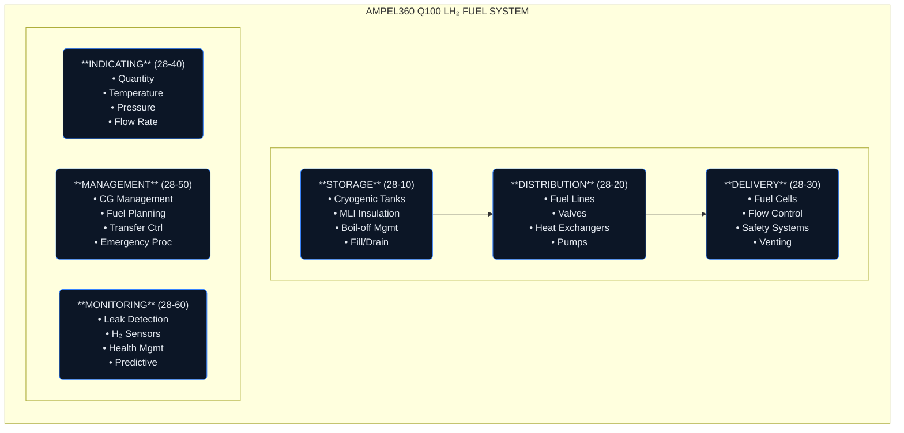

# ATA 28 — FUEL SYSTEMS
## AMPEL360 Q100 100-Passenger BWB Zero-Emission Aircraft

**Version:** 1.0.0  
**Status:** Active Development  
**Last Updated:** 2026-01-27  
**ATA Chapter:** 28  
**Framework Axis:** T-TECHNOLOGIES / C2-CIRCULAR_CRYOGENIC_CELLS

---

## System Overview

### Mission Statement

The ATA 28 Fuel Systems chapter provides comprehensive documentation for the **Liquid Hydrogen (LH₂) cryogenic fuel storage, distribution, and management systems** for the AMPEL360 Q100 100-passenger Blended Wing Body (BWB) zero-emission aircraft.

### Aircraft Concept

| Parameter | Specification |
|-----------|---------------|
| **Aircraft Type** | Blended Wing Body (BWB) |
| **Passenger Capacity** | 100 PAX |
| **Propulsion** | H₂ PEM Fuel Cell + Electric |
| **Fuel Type** | Liquid Hydrogen (LH₂) |
| **Emission Target** | Zero CO₂ In-Flight |
| **Design Range** | Regional (500-1000 nm) |

### Fuel System Architecture



---

## Directory Structure

This ATA chapter follows the **canonical ATA-XX schema** with full GENESIS → KDB/SSOT → IDB/OPS/PUBS layers:

```
ATA_28-FUEL/
├── README.md                           # This file
├── NAMING_CONVENTIONS.md               # ID grammar rules for ATA-28
├── TRACEABILITY_CONVENTIONS.md         # Trace link semantics
├── GOVERNANCE_POLICY.md                # Baseline policy and change authority
│
├── WBS/                                # Work Breakdown Structure
│   ├── SYSTEM_MISSION.md
│   ├── SYSTEM_VISION.md
│   ├── SYSTEM_OBJECTIVES.md
│   ├── WBS_LEVEL_1.yaml
│   ├── WBS_LEVEL_2.yaml
│   ├── WBS_TRACE_TO_PROJECT.csv
│   └── WBS_BUDGET_TT.yaml
│
├── GOVERNANCE/                         # System-level governance
│   ├── README.md
│   ├── BASELINES.md
│   ├── BASELINE_REGISTER.csv
│   ├── CHANGE_LOG.md
│   ├── CHANGE_CONTROL/
│   ├── APPROVALS/
│   ├── RELEASES/
│   └── INCENTIVES/
│
├── INDEX/                              # System-wide traceability
│   ├── README.md
│   ├── SSOT_INDEX.yaml
│   ├── TRACE_MASTER.csv
│   ├── ID_REGISTRY.csv
│   └── ARTIFACT_CATALOG.yaml
│
└── 28-10-storage/                      # Section: Fuel Storage
    ├── README.md
    ├── SECTION_INDEX.yaml
    ├── GENESIS/                        # Uncertainty discovery
    └── 28-10-00_fuel-storage-general/  # Subject folder
        ├── README.md
        ├── SUBJECT_MANIFEST.yaml
        ├── GOVERNANCE/
        ├── INDEX/
        ├── KDB/                         # Knowledge Data Base
        │   ├── DEV/
        │   └── LM/
        │       └── SSOT/
        │           └── PLM/            # LC01-LC10
        ├── CONTRACTS/
        ├── ASIT/
        └── IDB/                         # Information Data Base
            ├── OPS/
            │   └── LM/                 # LC11-LC14
            └── PUB/
                ├── AMM/
                │   └── CSDB/
                ├── IPC/
                ├── SRM/
                └── CMM/
```

---

## ATA 28 Sections

| Section | Code | Title | Description |
|---------|------|-------|-------------|
| **28-10** | Storage | LH₂ Fuel Storage | Cryogenic tank systems, insulation, boil-off management |
| **28-20** | Distribution | Fuel Distribution | Lines, valves, heat exchangers, pumps |
| **28-30** | Delivery | Fuel Delivery | Fuel cell interface, flow control, safety |
| **28-40** | Indicating | Fuel Indicating | Quantity, temperature, pressure instrumentation |
| **28-50** | Management | Fuel Management | CG control, fuel planning, transfer systems |
| **28-60** | Monitoring | Safety Monitoring | Leak detection, H₂ sensors, health management |

---

## Key Technologies

### 1. Cryogenic LH₂ Storage (28-10)

| Technology | Description |
|------------|-------------|
| **Type IV Tanks** | Composite overwrap pressure vessels (COPV) |
| **MLI Insulation** | Multi-Layer Insulation for thermal management |
| **Boil-off Management** | Zero/Low boil-off design with active cooling |
| **Integrated Structure** | BWB-integrated conformal tank geometry |

### 2. LH₂ Distribution (28-20)

| Technology | Description |
|------------|-------------|
| **Vacuum-Jacketed Lines** | Insulated fuel transfer lines |
| **Cryogenic Valves** | Low-temperature rated solenoid/pneumatic valves |
| **Heat Exchangers** | Controlled vaporization for fuel cell delivery |
| **Boost Pumps** | Cryogenic-rated centrifugal pumps |

### 3. Safety Systems (28-60)

| Technology | Description |
|------------|-------------|
| **H₂ Leak Detection** | Catalytic and electrochemical sensors |
| **Vent Systems** | Controlled pressure relief and safe venting |
| **Fire Detection** | UV/IR flame detection with H₂ specificity |
| **Isolation Valves** | Automatic fault isolation capability |

---

## Dependencies

### Upstream Dependencies (Required By ATA-28)

| ATA Chapter | System | Interface |
|-------------|--------|-----------|
| **ATA 21** | Air Conditioning | Tank thermal management integration |
| **ATA 24** | Electrical Power | Pump motors, valve actuation, instrumentation |
| **ATA 31** | Indicating/Recording | Flight deck displays, FMS interface |
| **ATA 42** | IMA | Data processing, system integration |

### Downstream Dependencies (Requires ATA-28)

| ATA Chapter | System | Interface |
|-------------|--------|-----------|
| **ATA 71** | Power Plant | Fuel cell stack H₂ supply |
| **ATA 73** | Engine Fuel Control | Flow regulation to power plant |
| **ATA 45** | CMS | Health monitoring data |
| **ATA 85** | Fuel Cell Systems | Ground infrastructure interface |

---

## Contacts

| Role | Stakeholder | Contact |
|------|-------------|---------|
| **System Owner** | STK_SE (Systems Engineering) | systems@ampel360.eu |
| **Safety Authority** | STK_SF (Safety) | safety@ampel360.eu |
| **Configuration Mgmt** | STK_CM | config@ampel360.eu |
| **H₂ Domain Expert** | STK_H2 | hydrogen@ampel360.eu |

---

## Related Documents

- [ATA Chapter Scaling Framework](../../../../docs/ATA_CHAPTER_SCALING_FRAMEWORK.md)
- [ATA Chapter Onboarding Playbook](../../../../docs/ATA_CHAPTER_ONBOARDING.md)
- [CSDB Compliance Validation](../../../../docs/CSDB_COMPLIANCE_VALIDATION.md)
- [TEKNIA Manifesto](../../../../TEKNIA_MANIFESTO.md)

---

## Revision History

| Date | Version | Author | Change |
|------|---------|--------|--------|
| 2026-01-27 | 1.0.0 | STK_SE | Initial ATA-28 FUEL systems structure for Q100 BWB |

---

*This chapter is part of the AMPEL360 Q100 program demonstrating the full GENESIS → KDB → IDB pipeline for hydrogen-electric aviation documentation.*
