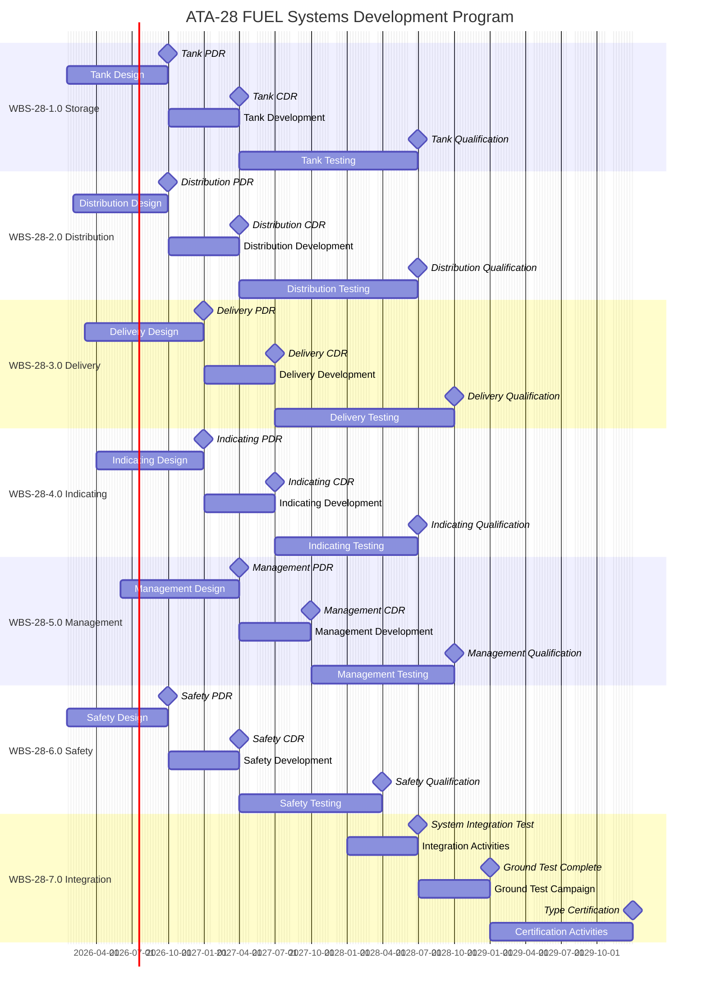
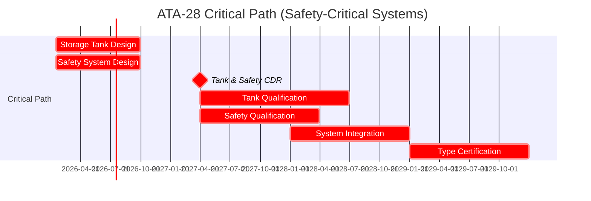
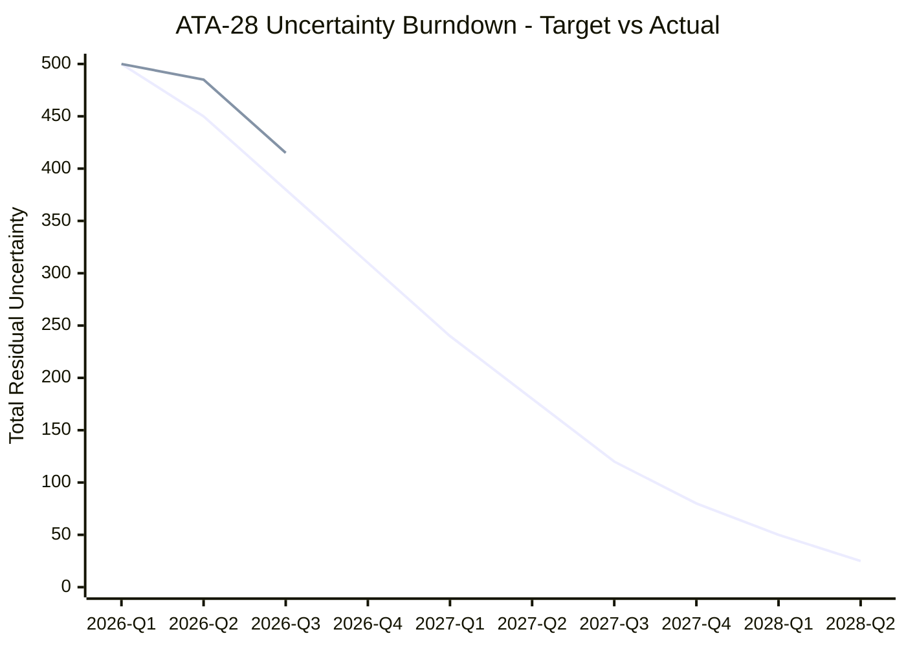
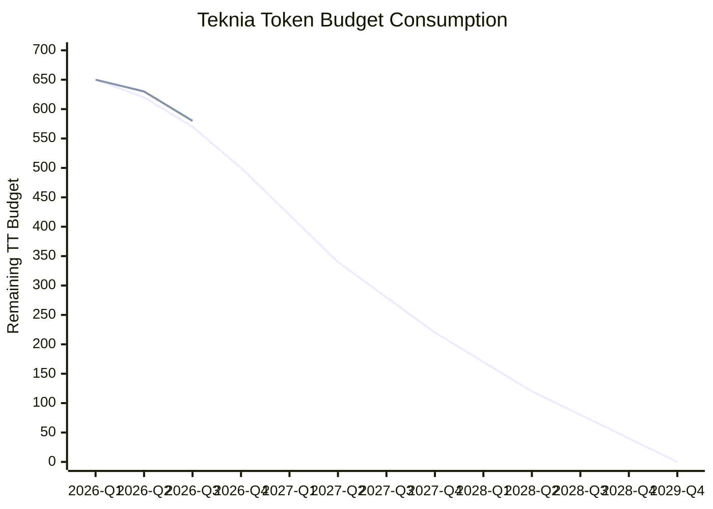
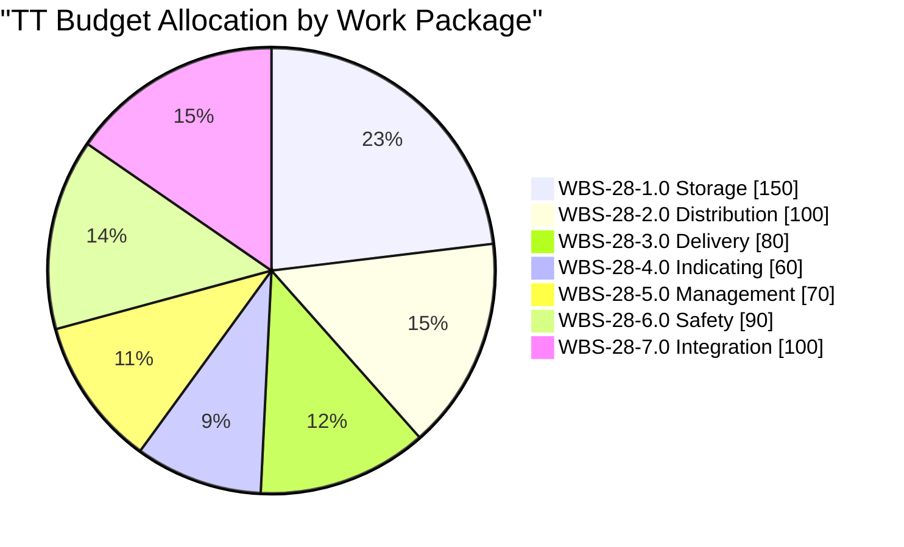
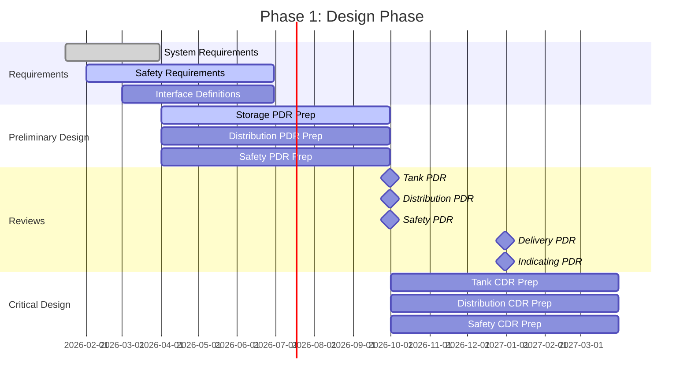
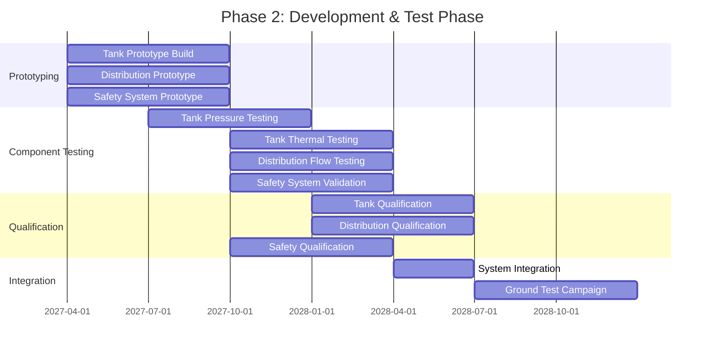
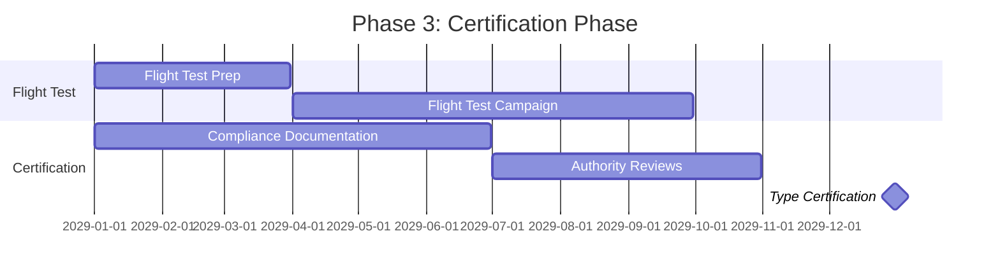
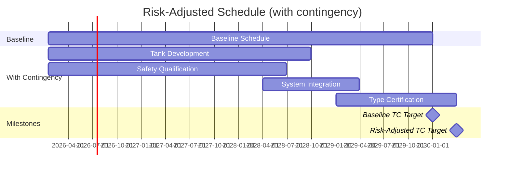

# ATA-28 FUEL Systems — Milestones & Progress Tracking

**Version:** 1.0.0  
**Status:** Active  
**Last Updated:** 2026-01-27  
**ATA Chapter:** 28 — Fuel Systems (LH₂)

---

## Executive Summary

This document provides comprehensive milestone tracking, GANTT scheduling, and burndown metrics for the AMPEL360 Q100 ATA-28 LH₂ Fuel Systems development program.

| Metric | Value |
|--------|-------|
| **Total Milestones** | 21 |
| **Work Packages** | 7 |
| **Total Budget (TT)** | 650 |
| **Program Duration** | 2026-Q1 to 2029-Q4 |
| **Critical Path** | Storage → Safety → Integration → Certification |

---

## Program GANTT Chart

### Overall Program Timeline



### Critical Path Analysis



---

## Milestone Register

### All Program Milestones

| ID | Milestone | Work Package | Target Date | Status | Dependencies |
|----|-----------|--------------|-------------|--------|--------------|
| MS-28-1.1 | Tank PDR | WBS-28-1.0 Storage | 2026-Q3 | 🔵 PLANNED | — |
| MS-28-1.2 | Tank CDR | WBS-28-1.0 Storage | 2027-Q1 | 🔵 PLANNED | MS-28-1.1 |
| MS-28-1.3 | Tank Qualification | WBS-28-1.0 Storage | 2028-Q2 | 🔵 PLANNED | MS-28-1.2 |
| MS-28-2.1 | Distribution PDR | WBS-28-2.0 Distribution | 2026-Q3 | 🔵 PLANNED | — |
| MS-28-2.2 | Distribution CDR | WBS-28-2.0 Distribution | 2027-Q1 | 🔵 PLANNED | MS-28-2.1 |
| MS-28-2.3 | Distribution Qualification | WBS-28-2.0 Distribution | 2028-Q2 | 🔵 PLANNED | MS-28-2.2 |
| MS-28-3.1 | Delivery PDR | WBS-28-3.0 Delivery | 2026-Q4 | 🔵 PLANNED | MS-28-1.1 |
| MS-28-3.2 | Delivery CDR | WBS-28-3.0 Delivery | 2027-Q2 | 🔵 PLANNED | MS-28-3.1 |
| MS-28-3.3 | Delivery Qualification | WBS-28-3.0 Delivery | 2028-Q3 | 🔵 PLANNED | MS-28-3.2 |
| MS-28-4.1 | Indicating PDR | WBS-28-4.0 Indicating | 2026-Q4 | 🔵 PLANNED | — |
| MS-28-4.2 | Indicating CDR | WBS-28-4.0 Indicating | 2027-Q2 | 🔵 PLANNED | MS-28-4.1 |
| MS-28-4.3 | Indicating Qualification | WBS-28-4.0 Indicating | 2028-Q2 | 🔵 PLANNED | MS-28-4.2 |
| MS-28-5.1 | Management PDR | WBS-28-5.0 Management | 2027-Q1 | 🔵 PLANNED | MS-28-4.1 |
| MS-28-5.2 | Management CDR | WBS-28-5.0 Management | 2027-Q3 | 🔵 PLANNED | MS-28-5.1 |
| MS-28-5.3 | Management Qualification | WBS-28-5.0 Management | 2028-Q3 | 🔵 PLANNED | MS-28-5.2 |
| MS-28-6.1 | Safety PDR | WBS-28-6.0 Safety | 2026-Q3 | 🔵 PLANNED | — |
| MS-28-6.2 | Safety CDR | WBS-28-6.0 Safety | 2027-Q1 | 🔵 PLANNED | MS-28-6.1 |
| MS-28-6.3 | Safety Qualification | WBS-28-6.0 Safety | 2028-Q1 | 🔵 PLANNED | MS-28-6.2 |
| MS-28-7.1 | System Integration Test | WBS-28-7.0 Integration | 2028-Q2 | 🔵 PLANNED | MS-28-1.3, MS-28-6.3 |
| MS-28-7.2 | Ground Test Complete | WBS-28-7.0 Integration | 2028-Q4 | 🔵 PLANNED | MS-28-7.1 |
| MS-28-7.3 | Type Certification | WBS-28-7.0 Integration | 2029-Q4 | 🔵 PLANNED | MS-28-7.2 |

**Status Legend:** 🟢 COMPLETE | 🟡 IN_PROGRESS | 🔵 PLANNED | 🔴 AT_RISK | ⚫ BLOCKED

---

## Burndown Charts

### Overall Uncertainty Burndown (KNOT Residuals)



### KNOT-Level Burndown Status

| KNOT ID | Title | Initial | Current | Target | Status | Trend |
|---------|-------|---------|---------|--------|--------|-------|
| KNOT-ATA28-10-00-001 | Cryogenic Tank Design | 100 | 65 | 10 | 🟡 IN_PROGRESS | ↓ On Track |
| KNOT-ATA28-10-00-002 | Tank Safety Case | 100 | 100 | 10 | 🔵 PLANNED | — Not Started |
| KNOT-ATA28-10-00-003 | Insulation Performance | 100 | 70 | 15 | 🟡 IN_PROGRESS | ↓ On Track |
| KNOT-ATA28-10-00-004 | Structural Qualification | 100 | 100 | 10 | 🔵 PLANNED | — Not Started |
| KNOT-ATA28-10-00-005 | Certification Strategy | 100 | 80 | 10 | 🟡 IN_PROGRESS | ↓ On Track |

**Current Total Residual:** 415 / 500 initial (17% reduction)

### Token Budget Burndown



---

## Work Package Progress

### Budget Allocation by Work Package



### Work Package Status Summary

| WBS ID | Title | Budget TT | Spent TT | Remaining TT | Progress |
|--------|-------|-----------|----------|--------------|----------|
| WBS-28-1.0 | Fuel Storage Systems | 150 | 25 | 125 | ▓▓░░░░░░░░ 17% |
| WBS-28-2.0 | Fuel Distribution Systems | 100 | 15 | 85 | ▓▓░░░░░░░░ 15% |
| WBS-28-3.0 | Fuel Delivery Systems | 80 | 10 | 70 | ▓░░░░░░░░░ 13% |
| WBS-28-4.0 | Fuel Indicating Systems | 60 | 8 | 52 | ▓░░░░░░░░░ 13% |
| WBS-28-5.0 | Fuel Management Systems | 70 | 5 | 65 | ▓░░░░░░░░░ 7% |
| WBS-28-6.0 | Safety and Monitoring | 90 | 15 | 75 | ▓▓░░░░░░░░ 17% |
| WBS-28-7.0 | System Integration | 100 | 0 | 100 | ░░░░░░░░░░ 0% |
| **TOTAL** | — | **650** | **78** | **572** | **12%** |

---

## Implementation Plan

### Phase 1: Design (2026-Q1 to 2027-Q1)



### Phase 2: Development & Test (2027-Q1 to 2028-Q4)



### Phase 3: Certification (2029)



---

## Risk-Adjusted Schedule

### Schedule Risk Analysis

| Risk | Probability | Impact | Mitigation | Schedule Buffer |
|------|-------------|--------|------------|-----------------|
| LH₂ tank certification delays | MEDIUM | HIGH | Early engagement with EASA | +3 months |
| MLI performance shortfall | LOW | MEDIUM | Parallel active cooling development | +2 months |
| Supply chain disruption | MEDIUM | MEDIUM | Dual-source strategy | +2 months |
| Test facility availability | LOW | HIGH | Early booking, backup facilities | +1 month |

### Contingency Timeline



---

## Reporting & Governance

### Monthly Status Report Template

| Section | Content |
|---------|---------|
| **Executive Summary** | Key achievements, risks, decisions needed |
| **Milestone Status** | Updated milestone table with RAG status |
| **Burndown Update** | Current vs planned uncertainty reduction |
| **Budget Status** | TT consumption vs plan |
| **Risk Register** | New/changed risks, mitigation status |
| **Action Items** | Open actions with owners and due dates |
| **Next Period Plan** | Planned activities for coming month |

### Review Cadence

| Review | Frequency | Participants | Purpose |
|--------|-----------|--------------|---------|
| Weekly Status | Weekly | WP Leads | Tactical progress, blockers |
| Monthly Review | Monthly | STK_PM, WP Leads | Milestone tracking, budget |
| Quarterly Review | Quarterly | STK_PM, STK_SE, STK_SF | Strategic alignment, risks |
| Gate Reviews | Per milestone | Full team + stakeholders | Design maturity gates |

---

## Task Implementation Checklist

### Immediate Tasks (2026-Q1)

- [x] Establish GENESIS layer with O-KNOTs and Y-KNOTs
- [x] Define LC01 problem statement and KNOT register
- [x] Create KNU planning matrix
- [x] Set up tokenomics allocation
- [ ] Complete system requirements baseline (LC02)
- [ ] Initiate safety assessment (FHA)
- [ ] Begin tank preliminary design studies

### Near-Term Tasks (2026-Q2)

- [ ] Complete functional hazard assessment
- [ ] Finalize tank sizing trade study
- [ ] Complete MLI design selection
- [ ] Establish interface control documents
- [ ] Prepare PDR packages for Q3 reviews

### Medium-Term Tasks (2026-Q3/Q4)

- [ ] Conduct Storage PDR (MS-28-1.1)
- [ ] Conduct Distribution PDR (MS-28-2.1)
- [ ] Conduct Safety PDR (MS-28-6.1)
- [ ] Begin CDR preparation activities
- [ ] Initiate prototype procurement

---

## Appendix: Milestone Data (CSV Format)

```csv
milestone_id,title,work_package,target_date,status,dependencies,critical_path
MS-28-1.1,Tank PDR,WBS-28-1.0,2026-09-30,PLANNED,,YES
MS-28-1.2,Tank CDR,WBS-28-1.0,2027-03-31,PLANNED,MS-28-1.1,YES
MS-28-1.3,Tank Qualification,WBS-28-1.0,2028-06-30,PLANNED,MS-28-1.2,YES
MS-28-2.1,Distribution PDR,WBS-28-2.0,2026-09-30,PLANNED,,NO
MS-28-2.2,Distribution CDR,WBS-28-2.0,2027-03-31,PLANNED,MS-28-2.1,NO
MS-28-2.3,Distribution Qualification,WBS-28-2.0,2028-06-30,PLANNED,MS-28-2.2,NO
MS-28-3.1,Delivery PDR,WBS-28-3.0,2026-12-31,PLANNED,MS-28-1.1,NO
MS-28-3.2,Delivery CDR,WBS-28-3.0,2027-06-30,PLANNED,MS-28-3.1,NO
MS-28-3.3,Delivery Qualification,WBS-28-3.0,2028-09-30,PLANNED,MS-28-3.2,NO
MS-28-4.1,Indicating PDR,WBS-28-4.0,2026-12-31,PLANNED,,NO
MS-28-4.2,Indicating CDR,WBS-28-4.0,2027-06-30,PLANNED,MS-28-4.1,NO
MS-28-4.3,Indicating Qualification,WBS-28-4.0,2028-06-30,PLANNED,MS-28-4.2,NO
MS-28-5.1,Management PDR,WBS-28-5.0,2027-03-31,PLANNED,MS-28-4.1,NO
MS-28-5.2,Management CDR,WBS-28-5.0,2027-09-30,PLANNED,MS-28-5.1,NO
MS-28-5.3,Management Qualification,WBS-28-5.0,2028-09-30,PLANNED,MS-28-5.2,NO
MS-28-6.1,Safety PDR,WBS-28-6.0,2026-09-30,PLANNED,,YES
MS-28-6.2,Safety CDR,WBS-28-6.0,2027-03-31,PLANNED,MS-28-6.1,YES
MS-28-6.3,Safety Qualification,WBS-28-6.0,2028-03-31,PLANNED,MS-28-6.2,YES
MS-28-7.1,System Integration Test,WBS-28-7.0,2028-06-30,PLANNED,"MS-28-1.3,MS-28-6.3",YES
MS-28-7.2,Ground Test Complete,WBS-28-7.0,2028-12-31,PLANNED,MS-28-7.1,YES
MS-28-7.3,Type Certification,WBS-28-7.0,2029-12-31,PLANNED,MS-28-7.2,YES
```

---

## Revision History

| Date | Version | Author | Change |
|------|---------|--------|--------|
| 2026-01-27 | 1.0.0 | STK_PM | Initial milestones document with GANTT and burndown charts |

---

*This document supports automated follow-ups and reporting for the ATA-28 FUEL Systems development program.*
