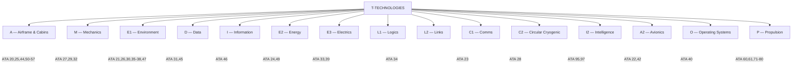
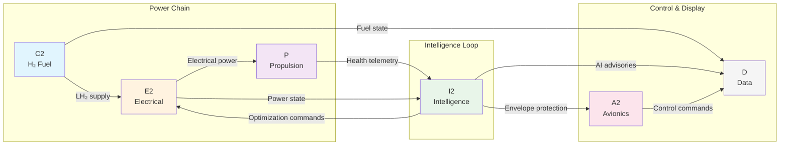

# T — Technologies: On-Board Systems

**OPT-IN Axis:** T (Technologies)  
**Full Path:** `OPT-IN_FRAMEWORK/T-TECHNOLOGIES_AMEDEOPELLICCIA-ON_BOARD_SYSTEMS/`  
**Scope:** All aircraft on-board systems, organized by functional domain  
**ATA Coverage:** ATA 20–57, 60–80, 95, 97  

---

## 1. Overview

The **T-TECHNOLOGIES** axis contains all on-board aircraft systems for the AMPEL360 Q100 BWB hydrogen-hybrid electric aircraft. Systems are organized into **15 functional domains** following a mnemonic structure that reflects system interdependencies and data flows.



| Code | Domain | Scope |
|------|--------|-------|
| [A](./A-AIRFRAME_CABINS/) | Airframe & Cabins | Structure + Interior |
| [M](./M-MECHANICS/) | Mechanics | Flight Controls, Hydraulics, Landing Gear |
| [E1](./E1-ENVIRONMENT/) | Environment | ECS, Fire, Ice, Oxygen, Pneumatic, Water |
| [D](./D-DATA/) | Data | Indicating, Recording, CMS |
| [I](./I-INFORMATION/) | Information | Information Systems |
| [E2](./E2-ENERGY/) | Energy | Electrical Power, APU |
| [E3](./E3-ELECTRICS/) | Electrics | Lights, Panels |
| [L1](./L1-LOGICS/) | Logics | Reserved |
| [L2](./L2-LINKS/) | Links | Navigation |
| [C1](./C1-COMMS/) | Comms | Communications |
| [C2](./C2-CIRCULAR_CRYOGENIC_CELLS/) | Circular Cryogenic | Fuel/H₂ Storage |
| [I2](./I2-INTELLIGENCE/) | Intelligence | AI/ML, Synthetic Data |
| [A2](./A2-AVIONICS/) | Avionics | Auto-flight, IMA |
| [O](./O-OPERATING_SYSTEMS/) | Operating Systems | Multisystem |
| [P](./P-PROPULSION/) | Propulsion | Engines, Propellers, Fuel Cell |

### 1.1 Design Philosophy

The T-axis domain organization reflects:

| Principle | Implementation |
|-----------|----------------|
| **Functional Cohesion** | Systems grouped by primary function |
| **Data Flow Alignment** | Domains ordered by information dependencies |
| **Certification Mapping** | Boundaries align with certification scope |
| **BWB-Specific Extensions** | Novel domains (I2, C2) for H₂ and AI systems |
| **Mnemonic Structure** | Domain codes form memorable patterns |

### 1.2 Key Q100-Specific Technologies

| Technology | Domain | ATA | Innovation |
|------------|--------|-----|------------|
| Neural Envelope Protection | I2 | 95 | ML-based flight control augmentation |
| H₂ Cryogenic Storage | C2 | 28 | LH₂ tank thermal management |
| Distributed Electric Propulsion | P | 61, 72 | Open-fan propulsors |
| Fuel Cell Integration | P | 85* | PEM fuel cell power generation |
| Predictive Health Monitoring | I2 | 95 | AI-driven maintenance optimization |
| Digital Product Passport | N† | 96 | Lifecycle traceability |

*ATA 85 (Fuel Cell Systems) under I-INFRASTRUCTURES for ground support; on-board aspects in P-PROPULSION  
†ATA 96 under N-NEURAL_NETWORKS (governance axis)

---

## 2. Domain Index

### 2.1 [A — Airframe & Cabins](./A-AIRFRAME_CABINS/)

**Scope:** Primary structure, doors, windows, interior equipment, cabin systems

| ATA | System | Section Range | Key Topics |
|-----|--------|---------------|------------|
| [20](./A-AIRFRAME_CABINS/ATA_20-STANDARD_PRACTICES_AIRFRAME/) | Standard Practices — Airframe | 20-00 to 20-90 | Procedures, materials, fasteners |
| [25](./A-AIRFRAME_CABINS/ATA_25-EQUIPMENT_FURNISHINGS/) | Equipment/Furnishings | 25-00 to 25-90 | Flight compartment, passenger cabin, galley, lavatories |
| [44](./A-AIRFRAME_CABINS/ATA_44-CABIN_SYSTEMS/) | Cabin Systems | 44-00 to 44-90 | IFE, connectivity, cabin monitoring |
| [50](./A-AIRFRAME_CABINS/ATA_50-CARGO_AND_ACCESSORY_COMPARTMENTS/) | Cargo & Accessory Compartments | 50-00 to 50-90 | Cargo handling, loading systems |
| [51](./A-AIRFRAME_CABINS/ATA_51-STANDARD_PRACTICES_GENERAL/) | Standard Practices — General | 51-00 to 51-90 | Repairs, bonding, balancing |
| [52](./A-AIRFRAME_CABINS/ATA_52-DOORS/) | Doors | 52-00 to 52-90 | Passenger, cargo, emergency exits |
| [53](./A-AIRFRAME_CABINS/ATA_53-FUSELAGE/) | Fuselage | 53-00 to 53-90 | BWB center body, aft fuselage |
| [54](./A-AIRFRAME_CABINS/ATA_54-NACELLES_PYLONS/) | Nacelles/Pylons | 54-00 to 54-90 | Propulsor nacelles, mounting |
| [55](./A-AIRFRAME_CABINS/ATA_55-STABILIZERS/) | Stabilizers | 55-00 to 55-90 | Horizontal/vertical stabilizers, control surfaces |
| [56](./A-AIRFRAME_CABINS/ATA_56-WINDOWS/) | Windows | 56-00 to 56-90 | Flight deck, passenger windows |
| [57](./A-AIRFRAME_CABINS/ATA_57-WINGS/) | Wings | 57-00 to 57-90 | BWB wing integration, control surfaces |

**Q100 Highlights:**
- BWB configuration with blended fuselage-wing structure (ATA 53/57)
- Distributed propulsor nacelles (ATA 54)
- Integrated cargo volumes within BWB planform (ATA 50)

---

### 2.2 [M — Mechanics](./M-MECHANICS/)

**Scope:** Flight control actuation, hydraulic power, landing gear systems

| ATA | System | Section Range | Key Topics |
|-----|--------|---------------|------------|
| [27](./M-MECHANICS/ATA_27-FLIGHT_CONTROLS/) | Flight Controls | 27-00 to 27-90 | Primary/secondary controls, fly-by-wire |
| [29](./M-MECHANICS/ATA_29-HYDRAULIC_POWER/) | Hydraulic Power | 29-00 to 29-90 | Generation, distribution, actuation |
| [32](./M-MECHANICS/ATA_32-LANDING_GEAR/) | Landing Gear | 32-00 to 32-90 | Main/nose gear, brakes, steering |

**Q100 Highlights:**
- Electro-hydrostatic actuators (EHA) for reduced hydraulic complexity
- Neural network augmentation for envelope protection (linked to [I2/ATA 95](./I2-INTELLIGENCE/ATA_95-AI_ML_MODELS/))
- Electric braking with regenerative capability

---

### 2.3 [E1 — Environment](./E1-ENVIRONMENT/)

**Scope:** Environmental control, protection systems, cabin atmosphere

| ATA | System | Section Range | Key Topics |
|-----|--------|---------------|------------|
| [21](./E1-ENVIRONMENT/ATA_21-AIR_CONDITIONING_PRESSURIZATION/) | Air Conditioning/Pressurization | 21-00 to 21-90 | ECS, temperature, humidity |
| [26](./E1-ENVIRONMENT/ATA_26-FIRE_PROTECTION/) | Fire Protection | 26-00 to 26-90 | Detection, suppression, H₂ safety |
| [30](./E1-ENVIRONMENT/ATA_30-ICE_RAIN_PROTECTION/) | Ice/Rain Protection | 30-00 to 30-90 | Anti-ice, de-ice, rain removal |
| [35](./E1-ENVIRONMENT/ATA_35-OXYGEN/) | Oxygen | 35-00 to 35-90 | Crew/passenger oxygen systems |
| [36](./E1-ENVIRONMENT/ATA_36-PNEUMATIC/) | Pneumatic | 36-00 to 36-90 | Bleed air distribution |
| [37](./E1-ENVIRONMENT/ATA_37-VACUUM/) | Vacuum | 37-00 to 37-90 | Vacuum systems |
| [38](./E1-ENVIRONMENT/ATA_38-WATER_WASTE/) | Water/Waste | 38-00 to 38-90 | Potable water, waste management |
| [47](./E1-ENVIRONMENT/ATA_47-NITROGEN_GENERATION_SYSTEM/) | Nitrogen Generation | 47-00 to 47-90 | OBIGGS, fuel tank inerting |

**Q100 Highlights:**
- Electric ECS (no engine bleed) optimized for fuel cell waste heat recovery
- Enhanced H₂ leak detection integrated with fire protection ([ATA 26](./E1-ENVIRONMENT/ATA_26-FIRE_PROTECTION/))
- Fuel tank inerting for H₂ ullage management ([ATA 47](./E1-ENVIRONMENT/ATA_47-NITROGEN_GENERATION_SYSTEM/))

---

### 2.4 [D — Data](./D-DATA/)

**Scope:** Flight deck displays, recorders, central maintenance

| ATA | System | Section Range | Key Topics |
|-----|--------|---------------|------------|
| [31](./D-DATA/ATA_31-INDICATING_RECORDING/) | Indicating/Recording | 31-00 to 31-90 | Instruments, FDR, CVR, displays |
| [45](./D-DATA/ATA_45-CENTRAL_MAINTENANCE_SYSTEM_CMS/) | Central Maintenance System | 45-00 to 45-90 | Onboard diagnostics, BITE, health monitoring |

**Q100 Highlights:**
- Integrated CMS with AI-driven fault prediction (linked to [I2/ATA 95](./I2-INTELLIGENCE/ATA_95-AI_ML_MODELS/))
- Enhanced parameter recording for H₂ system monitoring
- Digital twin data export for ground-based analytics

---

### 2.5 [I — Information](./I-INFORMATION/)

**Scope:** Aircraft information systems, EFB, data management

| ATA | System | Section Range | Key Topics |
|-----|--------|---------------|------------|
| [46](./I-INFORMATION/ATA_46-INFORMATION_SYSTEMS/) | Information Systems | 46-00 to 46-90 | Flight deck info, maintenance info, EFB |

**Q100 Highlights:**
- Integrated Electronic Flight Bag with AI advisory capabilities
- Real-time energy management displays
- Secure data links for operational optimization

---

### 2.6 [E2 — Energy](./E2-ENERGY/)

**Scope:** Electrical power generation and distribution, auxiliary power

| ATA | System | Section Range | Key Topics |
|-----|--------|---------------|------------|
| [24](./E2-ENERGY/ATA_24-ELECTRICAL_POWER/) | Electrical Power | 24-00 to 24-90 | Generation, distribution, batteries |
| [49](./E2-ENERGY/ATA_49-AIRBORNE_AUXILIARY_POWER_APU/) | Airborne Auxiliary Power | 49-00 to 49-90 | APU (or fuel cell equivalent) |

**Q100 Highlights:**
- Primary power from PEM fuel cells (H₂ + air → electricity + H₂O)
- High-voltage DC architecture (±270 VDC)
- Peak-power buffering via lithium batteries
- No traditional APU — fuel cell provides ground power

---

### 2.7 [E3 — Electrics](./E3-ELECTRICS/)

**Scope:** Lighting, electrical panels, multipurpose components

| ATA | System | Section Range | Key Topics |
|-----|--------|---------------|------------|
| [33](./E3-ELECTRICS/ATA_33-LIGHTS/) | Lights | 33-00 to 33-90 | Interior, exterior, emergency lighting |
| [39](./E3-ELECTRICS/ATA_39-ELECTRICAL_ELECTRONIC_PANELS_MULTIPURPOSE_COMPONENTS/) | Electrical/Electronic Panels | 39-00 to 39-90 | Panels, junction boxes, multipurpose |

**Q100 Highlights:**
- Full LED lighting for efficiency
- Simplified wiring with smart distribution units

---

### 2.8 [L1 — Logics](./L1-LOGICS/) (Reserved)

**Scope:** Reserved for future logic/computing systems

| ATA | System | Section Range | Key Topics |
|-----|--------|---------------|------------|
| — | [Reserved](./L1-LOGICS/00_RESERVED_AS_REQUIRED/) | 00-00 to 00-90 | Future allocation |

**Note:** Domain reserved for potential expansion (e.g., quantum computing, advanced logic systems).

---

### 2.9 [L2 — Links](./L2-LINKS/)

**Scope:** Navigation systems, position determination

| ATA | System | Section Range | Key Topics |
|-----|--------|---------------|------------|
| [34](./L2-LINKS/ATA_34-NAVIGATION/) | Navigation | 34-00 to 34-90 | INS, GPS, RNAV, landing aids, FMS |

**Q100 Highlights:**
- Multi-constellation GNSS with SBAS/GBAS
- Vision-based navigation backup
- Integrated FMS with energy-optimized trajectory computation

---

### 2.10 [C1 — Comms](./C1-COMMS/)

**Scope:** Communication systems

| ATA | System | Section Range | Key Topics |
|-----|--------|---------------|------------|
| [23](./C1-COMMS/ATA_23-COMMUNICATIONS/) | Communications | 23-00 to 23-90 | VHF, HF, SATCOM, ACARS, interphone |

**Q100 Highlights:**
- Enhanced SATCOM for continuous connectivity
- Secure datalinks for operational optimization
- Integrated audio management

---

### 2.11 [C2 — Circular Cryogenic Cells](./C2-CIRCULAR_CRYOGENIC_CELLS/)

**Scope:** Fuel storage and distribution (emphasis on LH₂)

| ATA | System | Section Range | Key Topics |
|-----|--------|---------------|------------|
| [28](./C2-CIRCULAR_CRYOGENIC_CELLS/ATA_28-FUEL/) | Fuel | 28-00 to 28-90 | Storage, distribution, indicating, H₂ specifics |

**Q100 Highlights:**
- Vacuum-insulated LH₃ tanks (forward + aft)
- Cryogenic thermal management
- Boil-off management and re-liquefaction
- Ortho-para hydrogen conversion monitoring
- DPP integration for fuel provenance

**Domain Name Rationale:** "Circular Cryogenic Cells" reflects:
- **Circular:** Alignment with circularity/DPP objectives
- **Cryogenic:** LH₂ storage at 20 K
- **Cells:** Fuel cell integration (H₂ → electrical power)

---

### 2.12 [I2 — Intelligence](./I2-INTELLIGENCE/)

**Scope:** AI/ML systems, synthetic data validation

| ATA | System | Section Range | Key Topics |
|-----|--------|---------------|------------|
| [95](./I2-INTELLIGENCE/ATA_95-AI_ML_MODELS/) | AI/ML Models | 95-00 to 95-90 | Model governance, training, V&V, deployment, monitoring |
| [97](./I2-INTELLIGENCE/ATA_97-SYNTHETIC_DATA_VALIDATION/) | Synthetic Data Validation | 97-00 to 97-90 | Synthetic data generation, validation protocols |

**Q100 Highlights:**
- Flight envelope protection neural network (DAL A)
- Predictive health monitoring (DAL B)
- Energy management optimization (DAL B)
- Pilot situational awareness enhancement (DAL C)
- Comprehensive learning assurance framework

**Certification Approach:**
- EASA AI Roadmap 2.0 compliance
- Special Conditions for Level 3 applications
- Runtime monitoring for assurance credit

---

### 2.13 [A2 — Avionics](./A2-AVIONICS/)

**Scope:** Auto-flight, integrated modular avionics

| ATA | System | Section Range | Key Topics |
|-----|--------|---------------|------------|
| [22](./A2-AVIONICS/ATA_22-AUTO_FLIGHT/) | Auto Flight | 22-00 to 22-90 | Autopilot, autothrottle, FGS |
| [42](./A2-AVIONICS/ATA_42-INTEGRATED_MODULAR_AVIONICS/) | Integrated Modular Avionics | 42-00 to 42-90 | IMA platforms, partitioning |

**Q100 Highlights:**
- IMA architecture with ARINC 653 partitioning
- AI-augmented autopilot with neural envelope protection
- Energy-aware autothrottle for H₂ economy

---

### 2.14 [O — Operating Systems](./O-OPERATING_SYSTEMS/)

**Scope:** Multi-system integration

| ATA | System | Section Range | Key Topics |
|-----|--------|---------------|------------|
| [40](./O-OPERATING_SYSTEMS/ATA_40-MULTISYSTEM/) | Multisystem | 40-00 to 40-90 | Cross-system integration, common functions |

**Q100 Highlights:**
- Vehicle management system coordination
- Cross-domain data bus architecture
- System-level health monitoring

---

### 2.15 [P — Propulsion](./P-PROPULSION/)

**Scope:** Propulsion systems, engines, propellers, supporting systems

| ATA | System | Section Range | Key Topics |
|-----|--------|---------------|------------|
| [60](./P-PROPULSION/ATA_60-STANDARD_PRACTICES_PROPELLER_ROTOR/) | Standard Practices — Propeller/Rotor | 60-00 to 60-90 | Propeller maintenance standards |
| [61](./P-PROPULSION/ATA_61-PROPELLERS_PROPULSORS/) | Propellers/Propulsors | 61-00 to 61-90 | Open-fan propulsors, pitch control |
| [71](./P-PROPULSION/ATA_71-POWER_PLANT/) | Power Plant | 71-00 to 71-90 | Installation, cowling, mounts |
| [72](./P-PROPULSION/ATA_72-ENGINE_TURBINE_TURBOPROP_DUCTED_UNDUCTED_FAN/) | Engine | 72-00 to 72-90 | Electric motors, hybrid turbine |
| [73](./P-PROPULSION/ATA_73-ENGINE_FUEL_AND_CONTROL/) | Engine Fuel and Control | 73-00 to 73-90 | H₂ delivery to power plant |
| [74](./P-PROPULSION/ATA_74-IGNITION/) | Ignition | 74-00 to 74-90 | (Limited for electric propulsion) |
| [75](./P-PROPULSION/ATA_75-AIR/) | Air | 75-00 to 75-90 | Engine cooling, intake management |
| [76](./P-PROPULSION/ATA_76-ENGINE_CONTROLS/) | Engine Controls | 76-00 to 76-90 | FADEC, motor controllers |
| [77](./P-PROPULSION/ATA_77-ENGINE_INDICATING/) | Engine Indicating | 77-00 to 77-90 | Power, temperature, health monitoring |
| [78](./P-PROPULSION/ATA_78-EXHAUST/) | Exhaust | 78-00 to 78-90 | (Minimal for electric; H₂O exhaust from fuel cells) |
| [79](./P-PROPULSION/ATA_79-OIL/) | Oil | 79-00 to 79-90 | Lubrication systems |
| [80](./P-PROPULSION/ATA_80-STARTING/) | Starting | 80-00 to 80-90 | Electric start systems |

**Q100 Highlights:**
- Distributed electric propulsion with 4–6 open-fan propulsors
- High-power electric motors (>2 MW per unit)
- PEM fuel cell stacks as primary power source
- Hybrid turbogenerator for peak power / emergency backup
- No combustion exhaust — H₂O + heat only from fuel cells

---

## 3. Cross-Domain Dependencies

### 3.1 Primary Data Flows



### 3.2 Key Interfaces

| Interface | From | To | Data Type |
|-----------|------|----|-----------| 
| Fuel state | [C2 (ATA 28)](./C2-CIRCULAR_CRYOGENIC_CELLS/ATA_28-FUEL/) | [E2 (ATA 24)](./E2-ENERGY/ATA_24-ELECTRICAL_POWER/) | LH₂ level, pressure, temperature |
| Power demand | [P (ATA 72)](./P-PROPULSION/ATA_72-ENGINE_TURBINE_TURBOPROP_DUCTED_UNDUCTED_FAN/) | [E2 (ATA 24)](./E2-ENERGY/ATA_24-ELECTRICAL_POWER/) | Motor power requests |
| Health data | [D (ATA 45)](./D-DATA/ATA_45-CENTRAL_MAINTENANCE_SYSTEM_CMS/) | [I2 (ATA 95)](./I2-INTELLIGENCE/ATA_95-AI_ML_MODELS/) | Sensor fusion for predictive maintenance |
| Control commands | [A2 (ATA 22)](./A2-AVIONICS/ATA_22-AUTO_FLIGHT/) | [M (ATA 27)](./M-MECHANICS/ATA_27-FLIGHT_CONTROLS/) | Flight control surface commands |
| AI advisories | [I2 (ATA 95)](./I2-INTELLIGENCE/ATA_95-AI_ML_MODELS/) | [D (ATA 31)](./D-DATA/ATA_31-INDICATING_RECORDING/) | Pilot display inputs |
| Energy optimization | [I2 (ATA 95)](./I2-INTELLIGENCE/ATA_95-AI_ML_MODELS/) | [E2 (ATA 24)](./E2-ENERGY/ATA_24-ELECTRICAL_POWER/) | Power scheduling commands |

---

## 4. Folder Structure

```
T-TECHNOLOGIES_AMEDEOPELLICCIA-ON_BOARD_SYSTEMS/
├── README.md                    # This file
├── 00_INDEX.md                  # Quick reference index
│
├── A-AIRFRAME_CABINS/
│   ├── README.md
│   ├── ATA_20-STANDARD_PRACTICES_AIRFRAME/
│   ├── ATA_25-EQUIPMENT_FURNISHINGS/
│   ├── ATA_44-CABIN_SYSTEMS/
│   ├── ATA_50-CARGO_AND_ACCESSORY_COMPARTMENTS/
│   ├── ATA_51-STANDARD_PRACTICES_GENERAL/
│   ├── ATA_52-DOORS/
│   ├── ATA_53-FUSELAGE/
│   ├── ATA_54-NACELLES_PYLONS/
│   ├── ATA_55-STABILIZERS/
│   ├── ATA_56-WINDOWS/
│   └── ATA_57-WINGS/
│
├── M-MECHANICS/
│   ├── README.md
│   ├── ATA_27-FLIGHT_CONTROLS/
│   ├── ATA_29-HYDRAULIC_POWER/
│   └── ATA_32-LANDING_GEAR/
│
├── E1-ENVIRONMENT/
│   ├── README.md
│   ├── ATA_21-AIR_CONDITIONING_PRESSURIZATION/
│   ├── ATA_26-FIRE_PROTECTION/
│   ├── ATA_30-ICE_RAIN_PROTECTION/
│   ├── ATA_35-OXYGEN/
│   ├── ATA_36-PNEUMATIC/
│   ├── ATA_37-VACUUM/
│   ├── ATA_38-WATER_WASTE/
│   └── ATA_47-NITROGEN_GENERATION_SYSTEM/
│
├── D-DATA/
│   ├── README.md
│   ├── ATA_31-INDICATING_RECORDING/
│   └── ATA_45-CENTRAL_MAINTENANCE_SYSTEM_CMS/
│
├── I-INFORMATION/
│   ├── README.md
│   └── ATA_46-INFORMATION_SYSTEMS/
│
├── E2-ENERGY/
│   ├── README.md
│   ├── ATA_24-ELECTRICAL_POWER/
│   └── ATA_49-AIRBORNE_AUXILIARY_POWER_APU/
│
├── E3-ELECTRICS/
│   ├── README.md
│   ├── ATA_33-LIGHTS/
│   └── ATA_39-ELECTRICAL_ELECTRONIC_PANELS_MULTIPURPOSE_COMPONENTS/
│
├── L1-LOGICS/
│   ├── README.md
│   └── 00_RESERVED_AS_REQUIRED/
│
├── L2-LINKS/
│   ├── README.md
│   └── ATA_34-NAVIGATION/
│
├── C1-COMMS/
│   ├── README.md
│   └── ATA_23-COMMUNICATIONS/
│
├── C2-CIRCULAR_CRYOGENIC_CELLS/
│   ├── README.md
│   └── ATA_28-FUEL/
│
├── I2-INTELLIGENCE/
│   ├── README.md
│   ├── ATA_95-AI_ML_MODELS/
│   └── ATA_97-SYNTHETIC_DATA_VALIDATION/
│
├── A2-AVIONICS/
│   ├── README.md
│   ├── ATA_22-AUTO_FLIGHT/
│   └── ATA_42-INTEGRATED_MODULAR_AVIONICS/
│
├── O-OPERATING_SYSTEMS/
│   ├── README.md
│   └── ATA_40-MULTISYSTEM/
│
└── P-PROPULSION/
    ├── README.md
    ├── ATA_60-STANDARD_PRACTICES_PROPELLER_ROTOR/
    ├── ATA_61-PROPELLERS_PROPULSORS/
    ├── ATA_71-POWER_PLANT/
    ├── ATA_72-ENGINE_TURBINE_TURBOPROP_DUCTED_UNDUCTED_FAN/
    ├── ATA_73-ENGINE_FUEL_AND_CONTROL/
    ├── ATA_74-IGNITION/
    ├── ATA_75-AIR/
    ├── ATA_76-ENGINE_CONTROLS/
    ├── ATA_77-ENGINE_INDICATING/
    ├── ATA_78-EXHAUST/
    ├── ATA_79-OIL/
    └── ATA_80-STARTING/
```

---

## 5. SSOT / PUB Pattern

Each ATA chapter follows the canonical content pattern:

```
ATA_XX-<SYSTEM>/
└── ATA-xx-<system>/
    └── xx-yy-<section>/
        ├── README.md
        ├── SSOT/
        │   ├── LC01_PROBLEM_STATEMENT/
        │   ├── LC02_SYSTEM_REQUIREMENTS/
        │   ├── LC03_SAFETY_RELIABILITY/
        │   ├── LC04_DESIGN_DEFINITION/
        │   ├── LC05_ANALYSIS_MODELS/
        │   ├── LC06_VERIFICATION/
        │   ├── LC07_VALIDATION/
        │   ├── LC08_CONFIGURATION/
        │   ├── LC09_PRODUCTION/
        │   ├── LC10_OPERATIONS/
        │   ├── LC11_MAINTENANCE/
        │   ├── LC12_CUSTOMER_CARE/
        │   ├── LC13_TRAINING/
        │   └── LC14_RETIREMENT_CIRCULARITY/
        └── PUB/
            └── AMM/
                ├── CSDB/
                │   ├── DM/
                │   ├── PM/
                │   ├── DML/
                │   ├── BREX/
                │   ├── ICN/
                │   ├── COMMON/
                │   └── APPLICABILITY/
                ├── EXPORT/
                └── IETP/
```

---

## 6. Key Standards

| Standard | Application |
|----------|-------------|
| **ATA iSpec 2200** | Chapter/section/subject structure |
| **S1000D** | CSDB technical publications |
| **DO-178C** | Software (traditional and ML-adapted) |
| **DO-254** | Hardware design assurance |
| **DO-160** | Environmental qualification |
| **ARP 4754A** | System development |
| **ARP 4761** | Safety assessment |
| **EASA AI Roadmap 2.0** | AI/ML certification (I2) |
| **SAE AIR 6988** | AI in aeronautical systems |

---

## 7. Domain Ownership

| Domain | Primary STK | Secondary STK |
|--------|-------------|---------------|
| A (Airframe/Cabins) | STK_SE | STK_SAF |
| M (Mechanics) | STK_SE | STK_TEST |
| E1 (Environment) | STK_SE | STK_SAF |
| D (Data) | STK_SE | STK_DATA |
| I (Information) | STK_SE | STK_SW |
| E2 (Energy) | STK_SE | STK_SAF |
| E3 (Electrics) | STK_SE | — |
| L1 (Logics) | STK_SE | — |
| L2 (Links) | STK_SE | STK_OPS |
| C1 (Comms) | STK_SE | STK_OPS |
| C2 (Cryogenic) | STK_SE | STK_SAF |
| I2 (Intelligence) | STK_AI | STK_CERT |
| A2 (Avionics) | STK_SE | STK_SW |
| O (Operating Systems) | STK_SE | STK_SW |
| P (Propulsion) | STK_SE | STK_SAF |

---

## 8. Related OPT-IN Axes

| Axis | Relationship |
|------|--------------|
| [**O — Organizations**](../O-ORGANIZATIONS/) | Maintenance policy affecting T-axis systems |
| [**P — Programs**](../P-PROGRAMS/) | Ground handling, servicing procedures for T-axis |
| [**I — Infrastructures**](../I-INFRASTRUCTURES/) | GSE, H₂ supply chain supporting T-axis |
| [**N — Neural Networks**](../N-NEURAL_NETWORKS/) | Governance, traceability for T-axis (especially [I2](./I2-INTELLIGENCE/)) |

---

## 9. Revision History

| Date | Author | Change |
|------|--------|--------|
| 2026-01-11 | AMPEL360 Baseline Architect | Initial T-axis README |

---

*This document is part of the AMPEL360 Q100 SSOT baseline under the OPT-IN Framework.*

*T-TECHNOLOGIES encompasses all on-board aircraft systems for the next-generation hydrogen-hybrid BWB aircraft.*
