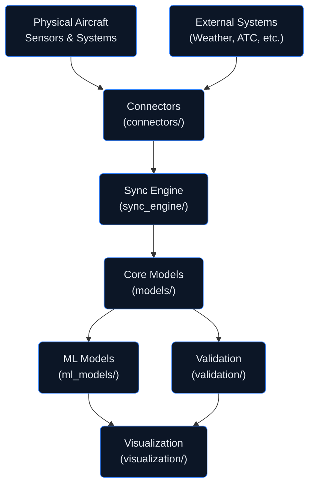

# Digital Twin Architecture
## AMPEL360 Q100 Digital Twin Workflow System

**Version:** 1.0.0  
**Status:** Active Development  
**Last Updated:** 2026-01-29

---

## Document Control

| Property | Value |
|----------|-------|
| Document ID | DT-ARCH-001 |
| Classification | CONSORTIUM |
| Approver | STK_PMO |
| Review Cycle | Quarterly |

---

## 1. Overview

The **Digital Twin Architecture** provides a comprehensive workflow system for creating, managing, and synchronizing digital representations of AMPEL360 Q100 aircraft components. This directory implements the core digital twin infrastructure supporting:

- **Real-time Monitoring** — Live data synchronization with physical systems
- **Predictive Analytics** — ML-powered failure prediction and optimization
- **Visualization** — Interactive dashboards and 3D model rendering
- **Validation** — Continuous verification against physical counterparts

---

## 2. Directory Structure

```
digital_twin/
├── README.md                 # This file
├── models/                   # Core digital twin models for aircraft components
│   └── README.md
├── ml_models/                # Machine learning models for predictive analytics
│   └── README.md
├── connectors/               # Data connectors for external systems
│   └── README.md
├── sync_engine/              # Real-time synchronization engine
│   └── README.md
├── visualization/            # Visualization components and dashboards
│   └── README.md
└── validation/               # Validation and verification tools
    └── README.md
```

---

## 3. Architecture Overview

### 3.1 System Components

| Component | Directory | Purpose |
|-----------|-----------|---------|
| **Core Models** | `models/` | Digital twin representations of aircraft components |
| **ML Models** | `ml_models/` | Predictive analytics and anomaly detection |
| **Connectors** | `connectors/` | Integration with external data sources |
| **Sync Engine** | `sync_engine/` | Real-time data synchronization |
| **Visualization** | `visualization/` | Dashboards and 3D rendering |
| **Validation** | `validation/` | Verification and testing tools |

### 3.2 Data Flow



---

## 4. Integration with AMPEL360 Q100

### 4.1 ATA Chapter Mapping

| ATA Chapter | Digital Twin Component | Description |
|-------------|------------------------|-------------|
| ATA 24 | Electrical Power Model | Power distribution and battery state |
| ATA 28 | Fuel System Model | LH₂ storage and distribution |
| ATA 71 | Power Plant Model | Fuel cell and propulsion systems |
| ATA 73 | Engine Fuel Model | Fuel delivery and consumption |
| ATA 85 | Fuel Cell Infrastructure | Ground support integration |

### 4.2 KDB/IDB Integration

The digital twin system integrates with the Knowledge-Information architecture:

```
GENESIS (Uncertainty) → KDB (Knowledge) → Digital Twin (Runtime) → IDB (Publications)
```

---

## 5. Key Features

### 5.1 Real-Time Capabilities

- **Live Data Ingestion** — Sub-second latency from physical sensors
- **State Synchronization** — Continuous model updates
- **Event Processing** — Anomaly detection and alerting
- **Historical Playback** — Time-series data replay

### 5.2 Predictive Analytics

- **Failure Prediction** — Component lifecycle estimation
- **Performance Optimization** — Efficiency recommendations
- **Maintenance Scheduling** — Predictive maintenance windows
- **Anomaly Detection** — Real-time deviation alerts

### 5.3 Visualization

- **3D Model Rendering** — Interactive component visualization
- **Dashboard Widgets** — Real-time metrics displays
- **Alert Management** — Priority-based notification system
- **Historical Analysis** — Trend visualization and reporting

---

## 6. Getting Started

### 6.1 Prerequisites

- Python 3.10+
- Node.js 18+ (for visualization)
- Docker (for containerized deployment)
- Access to AMPEL360 Q100 data sources

### 6.2 Quick Start

```bash
# Clone repository
git clone https://github.com/AmedeoPelliccia/AMPEL360-Q100.git
cd AMPEL360-Q100/digital_twin

# Install dependencies
pip install -r requirements.txt

# Run validation suite
python -m validation.run_tests

# Start sync engine
python -m sync_engine.start
```

---

## 7. Security Considerations

### 7.1 Data Classification

| Data Type | Classification | Access Control |
|-----------|----------------|----------------|
| Sensor Data | CONSORTIUM | Role-based access |
| Model State | CONSORTIUM | Encryption at rest |
| Predictions | CONFIDENTIAL | Need-to-know basis |
| Visualizations | CONSORTIUM | Authenticated access |

### 7.2 Compliance

- **ISO/IEC 27001** — Information security management
- **DO-326A** — Airborne electronic hardware security
- **EU GDPR** — Personal data protection

---

## 8. Related Documentation

- [AMPEL360 Q100 README](../README.md)
- [KDB/IDB Architecture](../OPT-IN_FRAMEWORK/00_INDEX.md)
- [GENESIS Knowledge Model](../ONTOLOGY_GENESIS_KNOWLEDGE_MODEL.md)
- [Implementation Summary](../IMPLEMENTATION_SUMMARY.md)

---

## 9. Contacts

| Role | Stakeholder | Email |
|------|-------------|-------|
| Architecture Lead | STK_SE | systems@ampel360.eu |
| ML Lead | STK_AI | ml@ampel360.eu |
| Integration Lead | STK_IT | integration@ampel360.eu |
| Security Lead | STK_SF | security@ampel360.eu |

---

## 10. Revision History

| Date | Version | Author | Change |
|------|---------|--------|--------|
| 2026-01-29 | 1.0.0 | STK_SE | Initial digital twin architecture |

---

*This directory implements the Digital Twin workflow architecture for the AMPEL360 Q100 program, enabling real-time synchronization and predictive analytics for hydrogen-electric aircraft systems.*
