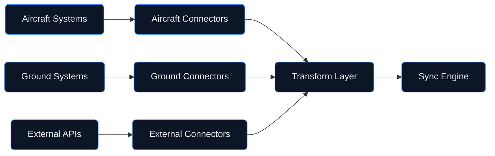

# Digital Twin — Data Connectors
## External System Integration Layer

**Version:** 1.0.0  
**Status:** Active Development  
**Last Updated:** 2026-01-29

---

## Document Control

| Property | Value |
|----------|-------|
| Document ID | DT-CON-001 |
| Classification | CONSORTIUM |
| Approver | STK_IT |
| Review Cycle | Quarterly |

---

## 1. Overview

The **connectors/** directory contains data connectors for integrating the AMPEL360 Q100 digital twin with external systems. These connectors provide:

- **Data Ingestion** — Real-time sensor data collection
- **Protocol Adapters** — Support for various communication protocols
- **Data Transformation** — Format conversion and normalization
- **Connection Management** — Fault-tolerant connection handling

---

## 2. Directory Structure

```
connectors/
├── README.md                     # This file
├── base/                         # Base connector classes
│   ├── connector.py              # Abstract base connector
│   ├── protocol.py               # Protocol interface definitions
│   └── transform.py              # Data transformation utilities
├── aircraft/                     # Aircraft data connectors
│   ├── arinc_429.py              # ARINC 429 bus connector
│   ├── arinc_664.py              # AFDX network connector
│   ├── can_bus.py                # CAN bus connector
│   └── discrete_io.py            # Discrete I/O connector
├── ground/                       # Ground system connectors
│   ├── mqtt_connector.py         # MQTT broker connector
│   ├── kafka_connector.py        # Apache Kafka connector
│   ├── rest_api.py               # REST API connector
│   └── websocket.py              # WebSocket connector
├── external/                     # External data source connectors
│   ├── weather_api.py            # Weather data connector
│   ├── atc_connector.py          # Air traffic control connector
│   ├── notam_connector.py        # NOTAM data connector
│   └── terrain_db.py             # Terrain database connector
├── database/                     # Database connectors
│   ├── timeseries_db.py          # Time-series database (InfluxDB)
│   ├── postgres_connector.py     # PostgreSQL connector
│   └── redis_connector.py        # Redis cache connector
└── schemas/                      # Data schemas
    ├── sensor_schema.json        # Sensor data schema
    ├── message_schema.json       # Message format schema
    └── config_schema.json        # Connector configuration schema
```

---

## 3. Connector Architecture

### 3.1 Base Connector Interface

```python
class BaseConnector(ABC):
    """Abstract base class for all data connectors."""
    
    @abstractmethod
    async def connect(self) -> None:
        """Establish connection to data source."""
        pass
    
    @abstractmethod
    async def disconnect(self) -> None:
        """Close connection gracefully."""
        pass
    
    @abstractmethod
    async def read(self) -> DataMessage:
        """Read data from source."""
        pass
    
    @abstractmethod
    async def write(self, data: DataMessage) -> None:
        """Write data to destination."""
        pass
    
    @property
    @abstractmethod
    def status(self) -> ConnectionStatus:
        """Current connection status."""
        pass
```

### 3.2 Data Flow



---

## 4. Supported Protocols

### 4.1 Aircraft Protocols

| Protocol | Connector | Data Rate | Latency |
|----------|-----------|-----------|---------|
| ARINC 429 | `ARINC429Connector` | 12.5-100 kbps | <1ms |
| AFDX (ARINC 664) | `AFDXConnector` | 100 Mbps | <5ms |
| CAN Bus | `CANConnector` | 1 Mbps | <1ms |
| Discrete I/O | `DiscreteIOConnector` | N/A | <100µs |

### 4.2 Ground Protocols

| Protocol | Connector | Use Case | Latency |
|----------|-----------|----------|---------|
| MQTT | `MQTTConnector` | Telemetry streaming | <50ms |
| Kafka | `KafkaConnector` | High-throughput events | <100ms |
| REST | `RESTConnector` | On-demand queries | <500ms |
| WebSocket | `WebSocketConnector` | Real-time updates | <10ms |

### 4.3 Database Protocols

| Database | Connector | Use Case | Throughput |
|----------|-----------|----------|------------|
| InfluxDB | `TimeSeriesConnector` | Sensor time-series | 100K pts/sec |
| PostgreSQL | `PostgresConnector` | Structured data | 10K ops/sec |
| Redis | `RedisConnector` | Cache/real-time | 100K ops/sec |

---

## 5. Usage Examples

### 5.1 ARINC 429 Connector

```python
from connectors.aircraft import ARINC429Connector

# Initialize connector
connector = ARINC429Connector(
    channel="RX1",
    labels=[0o310, 0o311, 0o312],  # Altitude, speed, heading
    speed="HIGH"
)

# Connect and read data
async with connector:
    while True:
        message = await connector.read()
        print(f"Label: {message.label:03o}, Data: {message.data}")
```

### 5.2 MQTT Connector

```python
from connectors.ground import MQTTConnector

# Initialize connector
connector = MQTTConnector(
    broker="mqtt.ampel360.eu",
    port=8883,
    topics=["aircraft/+/sensors/#"],
    tls=True
)

# Subscribe to topics
async with connector:
    async for message in connector.stream():
        print(f"Topic: {message.topic}, Payload: {message.payload}")
```

### 5.3 Weather API Connector

```python
from connectors.external import WeatherAPIConnector

# Initialize connector
connector = WeatherAPIConnector(
    api_key="your-api-key",
    base_url="https://api.weather.gov"
)

# Get weather data
async with connector:
    weather = await connector.get_forecast(
        latitude=48.8566,
        longitude=2.3522,
        hours=24
    )
    print(f"Temperature: {weather.temperature}°C")
    print(f"Wind: {weather.wind_speed} kt @ {weather.wind_direction}°")
```

---

## 6. Configuration

### 6.1 Connector Configuration Schema

```json
{
  "$schema": "http://json-schema.org/draft-07/schema#",
  "type": "object",
  "properties": {
    "connector_id": { "type": "string" },
    "type": { "type": "string" },
    "enabled": { "type": "boolean", "default": true },
    "connection": {
      "type": "object",
      "properties": {
        "host": { "type": "string" },
        "port": { "type": "integer" },
        "timeout": { "type": "number" },
        "retry_attempts": { "type": "integer" },
        "retry_delay": { "type": "number" }
      }
    },
    "transform": {
      "type": "object",
      "properties": {
        "format": { "enum": ["json", "binary", "xml"] },
        "schema": { "type": "string" }
      }
    }
  }
}
```

### 6.2 Example Configuration

```yaml
# connectors/config/mqtt_config.yaml
connector_id: mqtt-telemetry
type: mqtt
enabled: true
connection:
  host: mqtt.ampel360.eu
  port: 8883
  timeout: 30.0
  retry_attempts: 5
  retry_delay: 1.0
security:
  tls: true
  cert_path: /etc/ssl/certs/client.crt
  key_path: /etc/ssl/private/client.key
transform:
  format: json
  schema: schemas/sensor_schema.json
```

---

## 7. Error Handling

### 7.1 Retry Strategy

```python
from connectors.base import RetryStrategy

# Configure retry strategy
strategy = RetryStrategy(
    max_attempts=5,
    initial_delay=1.0,
    max_delay=60.0,
    exponential_base=2.0,
    jitter=True
)

# Apply to connector
connector.set_retry_strategy(strategy)
```

### 7.2 Circuit Breaker

```python
from connectors.base import CircuitBreaker

# Configure circuit breaker
breaker = CircuitBreaker(
    failure_threshold=5,
    recovery_timeout=30.0,
    half_open_requests=3
)

# Apply to connector
connector.set_circuit_breaker(breaker)
```

---

## 8. Monitoring

### 8.1 Metrics

| Metric | Description | Target |
|--------|-------------|--------|
| `connector_connected` | Connection status (1/0) | 1 |
| `connector_latency_ms` | Message latency | <50ms |
| `connector_errors_total` | Total error count | Minimized |
| `connector_messages_total` | Total messages processed | N/A |

### 8.2 Health Checks

```python
from connectors import ConnectorHealth

# Check connector health
health = ConnectorHealth.check_all()

for connector_id, status in health.items():
    print(f"{connector_id}: {status.state} (latency: {status.latency_ms}ms)")
```

---

## 9. Security

### 9.1 Authentication Methods

| Method | Use Case | Connectors |
|--------|----------|------------|
| TLS/mTLS | Encrypted transport | All network connectors |
| API Key | External APIs | Weather, ATC, NOTAM |
| OAuth 2.0 | Cloud services | REST API connectors |
| SASL | Message brokers | Kafka |

### 9.2 Data Encryption

- **In Transit** — TLS 1.3 for all network connections
- **At Rest** — AES-256 for cached data
- **Credentials** — Vault integration for secret management

---

## 10. Testing

### 10.1 Unit Tests

```bash
# Run connector tests
pytest connectors/tests/ -v

# Run with mocked external services
pytest connectors/tests/ -v --mock-external
```

### 10.2 Integration Tests

```bash
# Run integration tests (requires test environment)
pytest connectors/tests/integration/ -v --integration
```

---

## 11. Related Documentation

- [Digital Twin Architecture](../README.md)
- [Sync Engine](../sync_engine/README.md)
- [Core Models](../models/README.md)
- [Validation Tools](../validation/README.md)

---

## 12. Revision History

| Date | Version | Author | Change |
|------|---------|--------|--------|
| 2026-01-29 | 1.0.0 | STK_IT | Initial connectors structure |

---

*This directory contains data connectors for integrating the AMPEL360 Q100 digital twin with aircraft systems, ground infrastructure, and external data sources.*
