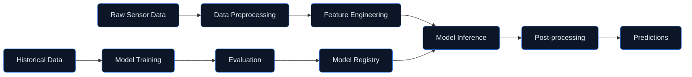

# Digital Twin — Machine Learning Models
## Predictive Analytics for Aircraft Systems

**Version:** 1.0.0  
**Status:** Active Development  
**Last Updated:** 2026-01-29

---

## Document Control

| Property | Value |
|----------|-------|
| Document ID | DT-ML-001 |
| Classification | CONFIDENTIAL |
| Approver | STK_AI |
| Review Cycle | Quarterly |

---

## 1. Overview

The **ml_models/** directory contains machine learning models for predictive analytics on AMPEL360 Q100 digital twin data. These models enable:

- **Anomaly Detection** — Real-time identification of abnormal behavior
- **Predictive Maintenance** — Component failure prediction
- **Performance Optimization** — Efficiency improvement recommendations
- **State Estimation** — Sensor fusion and state interpolation

---

## 2. Directory Structure

```
ml_models/
├── README.md                     # This file
├── anomaly/                      # Anomaly detection models
│   ├── isolation_forest.py       # Isolation forest model
│   ├── autoencoder.py            # Autoencoder-based detection
│   └── lstm_anomaly.py           # LSTM sequence anomaly
├── predictive/                   # Predictive maintenance models
│   ├── rul_estimator.py          # Remaining useful life estimation
│   ├── failure_predictor.py      # Component failure prediction
│   └── degradation_model.py      # Degradation curve modeling
├── optimization/                 # Performance optimization models
│   ├── efficiency_optimizer.py   # System efficiency optimization
│   ├── energy_management.py      # Energy management optimization
│   └── route_optimizer.py        # Flight route optimization
├── estimation/                   # State estimation models
│   ├── kalman_filter.py          # Kalman filter state estimation
│   ├── sensor_fusion.py          # Multi-sensor fusion
│   └── interpolation.py          # Missing data interpolation
├── training/                     # Model training utilities
│   ├── data_pipeline.py          # Training data pipeline
│   ├── hyperparameter_tuning.py  # Hyperparameter optimization
│   └── model_evaluation.py       # Model evaluation metrics
├── inference/                    # Model inference utilities
│   ├── batch_inference.py        # Batch inference pipeline
│   ├── streaming_inference.py    # Real-time streaming inference
│   └── model_server.py           # Model serving infrastructure
└── artifacts/                    # Trained model artifacts
    ├── models/                   # Serialized model files
    ├── configs/                  # Model configurations
    └── metrics/                  # Training metrics and logs
```

---

## 3. Model Categories

### 3.1 Anomaly Detection

| Model | Algorithm | Use Case | Latency |
|-------|-----------|----------|---------|
| `IsolationForest` | Isolation Forest | General anomaly detection | <10ms |
| `Autoencoder` | Deep Autoencoder | Complex pattern anomalies | <50ms |
| `LSTMAnomaly` | LSTM Sequence | Time-series anomalies | <100ms |

### 3.2 Predictive Maintenance

| Model | Algorithm | Output | Accuracy |
|-------|-----------|--------|----------|
| `RULEstimator` | CNN-LSTM | Remaining useful life (hours) | ±5% |
| `FailurePredictor` | Gradient Boosting | Failure probability (0-1) | 92% AUC |
| `DegradationModel` | Physics-informed NN | Degradation curve | ±3% |

### 3.3 Performance Optimization

| Model | Algorithm | Optimization Target | Improvement |
|-------|-----------|---------------------|-------------|
| `EfficiencyOptimizer` | Bayesian Optimization | System efficiency | +2-5% |
| `EnergyManagement` | Reinforcement Learning | Energy consumption | -3-8% |
| `RouteOptimizer` | Genetic Algorithm | Fuel consumption | -2-4% |

---

## 4. Architecture

### 4.1 ML Pipeline



### 4.2 Model Serving Architecture

```
┌─────────────────────────────────────────────────────────────┐
│                    Model Server (FastAPI)                   │
├─────────────────────────────────────────────────────────────┤
│  ┌─────────────┐  ┌─────────────┐  ┌─────────────┐         │
│  │   Anomaly   │  │ Predictive  │  │ Optimization│         │
│  │   Models    │  │   Models    │  │   Models    │         │
│  └─────────────┘  └─────────────┘  └─────────────┘         │
├─────────────────────────────────────────────────────────────┤
│                    Model Registry (MLflow)                  │
├─────────────────────────────────────────────────────────────┤
│                Feature Store (Feast/Redis)                  │
└─────────────────────────────────────────────────────────────┘
```

---

## 5. Usage Examples

### 5.1 Anomaly Detection

```python
from ml_models.anomaly import IsolationForest, Autoencoder

# Initialize anomaly detector
detector = IsolationForest(
    contamination=0.01,
    feature_columns=["temperature", "pressure", "vibration"]
)

# Load trained model
detector.load("artifacts/models/anomaly/iso_forest_v1.pkl")

# Detect anomalies
data = get_sensor_data(window="1h")
result = detector.predict(data)

if result.has_anomalies:
    for anomaly in result.anomalies:
        print(f"Anomaly at {anomaly.timestamp}: {anomaly.description}")
```

### 5.2 Remaining Useful Life Estimation

```python
from ml_models.predictive import RULEstimator

# Initialize RUL estimator
estimator = RULEstimator(
    component_type="fuel_cell",
    model_path="artifacts/models/rul/fuel_cell_v2.h5"
)

# Get component history
history = get_component_history("FC-001", window="30d")

# Estimate RUL
rul = estimator.predict(history)
print(f"Estimated RUL: {rul.hours:.0f} hours (CI: {rul.ci_lower:.0f}-{rul.ci_upper:.0f})")

# Schedule maintenance if needed
if rul.hours < 500:
    schedule_maintenance("FC-001", priority="HIGH")
```

### 5.3 Energy Management Optimization

```python
from ml_models.optimization import EnergyManagement

# Initialize optimizer
optimizer = EnergyManagement(
    model_path="artifacts/models/energy/rl_agent_v1.zip"
)

# Get current system state
state = get_system_state()

# Get optimized action
action = optimizer.optimize(state)

print(f"Recommended action: {action.description}")
print(f"Expected energy savings: {action.savings:.1%}")
```

---

## 6. Model Training

### 6.1 Training Pipeline

```python
from ml_models.training import DataPipeline, HyperparameterTuning

# Create data pipeline
pipeline = DataPipeline(
    source="digital_twin_db",
    start_date="2025-01-01",
    end_date="2026-01-01"
)

# Prepare training data
X_train, X_test, y_train, y_test = pipeline.prepare(
    target="failure_in_7d",
    test_size=0.2
)

# Hyperparameter tuning
tuner = HyperparameterTuning(
    model_class="GradientBoosting",
    search_space={
        "n_estimators": [100, 200, 500],
        "max_depth": [3, 5, 10],
        "learning_rate": [0.01, 0.1, 0.2]
    }
)

best_params = tuner.search(X_train, y_train, cv=5)
```

### 6.2 Model Evaluation

```python
from ml_models.training import ModelEvaluation

# Evaluate model
evaluator = ModelEvaluation(model, X_test, y_test)

# Get metrics
metrics = evaluator.evaluate()
print(f"AUC-ROC: {metrics.auc_roc:.3f}")
print(f"Precision: {metrics.precision:.3f}")
print(f"Recall: {metrics.recall:.3f}")
print(f"F1 Score: {metrics.f1:.3f}")

# Generate report
evaluator.generate_report("artifacts/metrics/evaluation_report.html")
```

---

## 7. Model Registry

### 7.1 Registered Models

| Model Name | Version | Stage | Accuracy | Last Updated |
|------------|---------|-------|----------|--------------|
| `anomaly_iso_forest` | 1.2 | Production | 94.2% | 2026-01-15 |
| `rul_fuel_cell` | 2.0 | Production | 91.8% | 2026-01-20 |
| `failure_predictor` | 1.5 | Staging | 92.5% | 2026-01-25 |
| `energy_optimizer` | 1.0 | Production | N/A | 2026-01-10 |

### 7.2 Model Versioning

```bash
# Register new model version
mlflow models register \
  --model-uri runs:/abc123/model \
  --name failure_predictor \
  --version 1.6

# Promote to production
mlflow models transition-stage \
  --name failure_predictor \
  --version 1.6 \
  --stage Production
```

---

## 8. Performance Monitoring

### 8.1 Metrics Dashboard

| Metric | Target | Current | Status |
|--------|--------|---------|--------|
| Inference Latency (p95) | <100ms | 45ms | ✅ |
| Model Accuracy | >90% | 93.2% | ✅ |
| Data Drift Score | <0.1 | 0.03 | ✅ |
| Feature Coverage | >95% | 98.5% | ✅ |

### 8.2 Alerting

- **Accuracy degradation** — Alert when model accuracy drops below threshold
- **Data drift** — Alert when input distribution changes significantly
- **Latency spike** — Alert when inference latency exceeds SLA

---

## 9. Testing

### 9.1 Unit Tests

```bash
# Run ML model tests
pytest ml_models/tests/ -v

# Run with coverage
pytest ml_models/tests/ --cov=ml_models --cov-report=html
```

### 9.2 Model Quality Tests

```bash
# Run model quality tests
pytest ml_models/tests/quality/ -v --model-quality
```

---

## 10. Related Documentation

- [Digital Twin Architecture](../README.md)
- [Core Models](../models/README.md)
- [Validation Tools](../validation/README.md)
- [Visualization](../visualization/README.md)

---

## 11. Revision History

| Date | Version | Author | Change |
|------|---------|--------|--------|
| 2026-01-29 | 1.0.0 | STK_AI | Initial ML models structure |

---

*This directory contains machine learning models for predictive analytics on AMPEL360 Q100 digital twin data, enabling anomaly detection, predictive maintenance, and performance optimization.*
