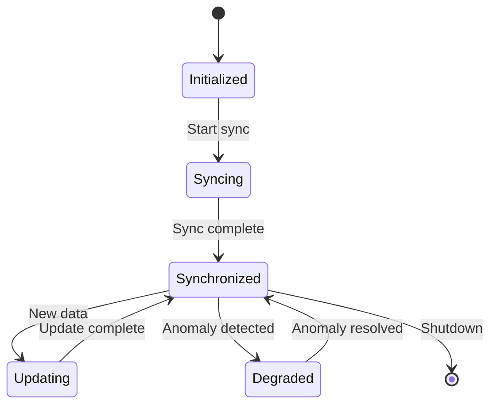

# Digital Twin — Core Models
## Aircraft Component Digital Twin Models

**Version:** 1.0.0  
**Status:** Active Development  
**Last Updated:** 2026-01-29

---

## Document Control

| Property | Value |
|----------|-------|
| Document ID | DT-MOD-001 |
| Classification | CONSORTIUM |
| Approver | STK_SE |
| Review Cycle | Quarterly |

---

## 1. Overview

The **models/** directory contains core digital twin models representing AMPEL360 Q100 aircraft components. Each model maintains a synchronized state with its physical counterpart and provides:

- **State Representation** — Complete component state modeling
- **Behavior Simulation** — Physics-based operational simulation
- **Interface Definitions** — Standardized data exchange protocols
- **Lifecycle Tracking** — Component health and degradation modeling

---

## 2. Directory Structure

```
models/
├── README.md                     # This file
├── base/                         # Base model classes and interfaces
│   ├── component_model.py        # Abstract base component model
│   ├── state_manager.py          # State management utilities
│   └── interfaces.py             # Common interfaces
├── electrical/                   # ATA 24 - Electrical power models
│   ├── battery_model.py          # Battery state and health
│   ├── power_distribution.py     # Power distribution network
│   └── fuel_cell_model.py        # Fuel cell stack model
├── fuel/                         # ATA 28 - Fuel system models
│   ├── tank_model.py             # LH₂ cryogenic tank model
│   ├── distribution_model.py     # Fuel distribution network
│   └── delivery_model.py         # Fuel delivery to power plant
├── propulsion/                   # ATA 71/73 - Propulsion models
│   ├── motor_model.py            # Electric motor model
│   ├── inverter_model.py         # Power inverter model
│   └── propulsor_model.py        # Distributed propulsor model
├── structural/                   # Structural component models
│   ├── airframe_model.py         # Airframe structural model
│   ├── wing_model.py             # Wing structural model
│   └── fuselage_model.py         # Fuselage structural model
└── schemas/                      # Model data schemas
    ├── component_schema.json     # Component model schema
    ├── state_schema.json         # State data schema
    └── event_schema.json         # Event data schema
```

---

## 3. Model Architecture

### 3.1 Base Model Interface

All component models implement the `ComponentModel` interface:

```python
class ComponentModel(ABC):
    """Abstract base class for digital twin component models."""
    
    @property
    @abstractmethod
    def component_id(self) -> str:
        """Unique component identifier."""
        pass
    
    @property
    @abstractmethod
    def state(self) -> Dict[str, Any]:
        """Current component state."""
        pass
    
    @abstractmethod
    def update(self, data: Dict[str, Any]) -> None:
        """Update model state with new data."""
        pass
    
    @abstractmethod
    def predict(self, horizon: float) -> Dict[str, Any]:
        """Predict future state."""
        pass
    
    @abstractmethod
    def validate(self) -> ValidationResult:
        """Validate model against constraints."""
        pass
```

### 3.2 State Management



---

## 4. Model Categories

### 4.1 Electrical Models (ATA 24)

| Model | Description | Key Parameters |
|-------|-------------|----------------|
| `BatteryModel` | Battery state of charge and health | SOC, SOH, temperature, current |
| `PowerDistributionModel` | Electrical bus and load management | Bus voltage, load current, breaker states |
| `FuelCellModel` | PEM fuel cell stack performance | Power output, efficiency, temperature |

### 4.2 Fuel System Models (ATA 28)

| Model | Description | Key Parameters |
|-------|-------------|----------------|
| `TankModel` | LH₂ cryogenic tank state | Level, pressure, temperature, boil-off |
| `DistributionModel` | Fuel distribution network | Flow rates, valve states, pressures |
| `DeliveryModel` | Fuel delivery to power plant | Delivery rate, purity, temperature |

### 4.3 Propulsion Models (ATA 71/73)

| Model | Description | Key Parameters |
|-------|-------------|----------------|
| `MotorModel` | Electric motor performance | RPM, torque, temperature, efficiency |
| `InverterModel` | Power inverter state | Input/output power, efficiency, temperature |
| `PropulsorModel` | Distributed propulsor | Thrust, blade pitch, vibration |

---

## 5. Data Schemas

### 5.1 Component State Schema

```json
{
  "$schema": "http://json-schema.org/draft-07/schema#",
  "type": "object",
  "properties": {
    "component_id": { "type": "string" },
    "timestamp": { "type": "string", "format": "date-time" },
    "state": {
      "type": "object",
      "additionalProperties": true
    },
    "health": {
      "type": "object",
      "properties": {
        "status": { "enum": ["NOMINAL", "DEGRADED", "CRITICAL", "FAILED"] },
        "confidence": { "type": "number", "minimum": 0, "maximum": 1 }
      }
    }
  },
  "required": ["component_id", "timestamp", "state"]
}
```

---

## 6. Usage Examples

### 6.1 Creating a Battery Model

```python
from models.electrical import BatteryModel

# Initialize model
battery = BatteryModel(
    component_id="BAT-ATA24-001",
    capacity_ah=100.0,
    nominal_voltage=400.0
)

# Update with sensor data
battery.update({
    "voltage": 395.2,
    "current": 25.5,
    "temperature": 32.1
})

# Get current state
state = battery.state
print(f"SOC: {state['soc']:.1%}, SOH: {state['soh']:.1%}")

# Predict future state
prediction = battery.predict(horizon=3600)  # 1 hour
print(f"Predicted SOC in 1h: {prediction['soc']:.1%}")
```

### 6.2 Creating a Fuel Tank Model

```python
from models.fuel import TankModel

# Initialize model
tank = TankModel(
    component_id="TANK-ATA28-001",
    capacity_kg=500.0,
    insulation_type="MLI"
)

# Update with sensor data
tank.update({
    "level_kg": 450.0,
    "pressure_bar": 2.5,
    "temperature_k": 22.0
})

# Calculate boil-off rate
boil_off = tank.calculate_boil_off()
print(f"Boil-off rate: {boil_off:.3f} kg/h")
```

---

## 7. Integration Points

### 7.1 Sync Engine Integration

Models receive updates through the sync engine:

```python
from sync_engine import SyncEngine
from models.electrical import BatteryModel

sync = SyncEngine()
battery = BatteryModel("BAT-001")

# Register model with sync engine
sync.register_model(battery, sources=["sensor_bus_24"])

# Start synchronization
sync.start()
```

### 7.2 ML Model Integration

Core models provide data to ML models for predictions:

```python
from ml_models import AnomalyDetector
from models.fuel import TankModel

tank = TankModel("TANK-001")
detector = AnomalyDetector(model=tank)

# Run anomaly detection
result = detector.analyze(window="1h")
if result.anomaly_detected:
    print(f"Anomaly: {result.description}")
```

---

## 8. Testing

### 8.1 Unit Tests

```bash
# Run model unit tests
pytest models/tests/ -v

# Run with coverage
pytest models/tests/ --cov=models --cov-report=html
```

### 8.2 Integration Tests

```bash
# Run integration tests
pytest models/tests/integration/ -v --integration
```

---

## 9. Related Documentation

- [Digital Twin Architecture](../README.md)
- [ML Models](../ml_models/README.md)
- [Sync Engine](../sync_engine/README.md)
- [Validation Tools](../validation/README.md)

---

## 10. Revision History

| Date | Version | Author | Change |
|------|---------|--------|--------|
| 2026-01-29 | 1.0.0 | STK_SE | Initial core models structure |

---

*This directory contains the core digital twin models for AMPEL360 Q100 aircraft components, providing state representation and behavior simulation capabilities.*
