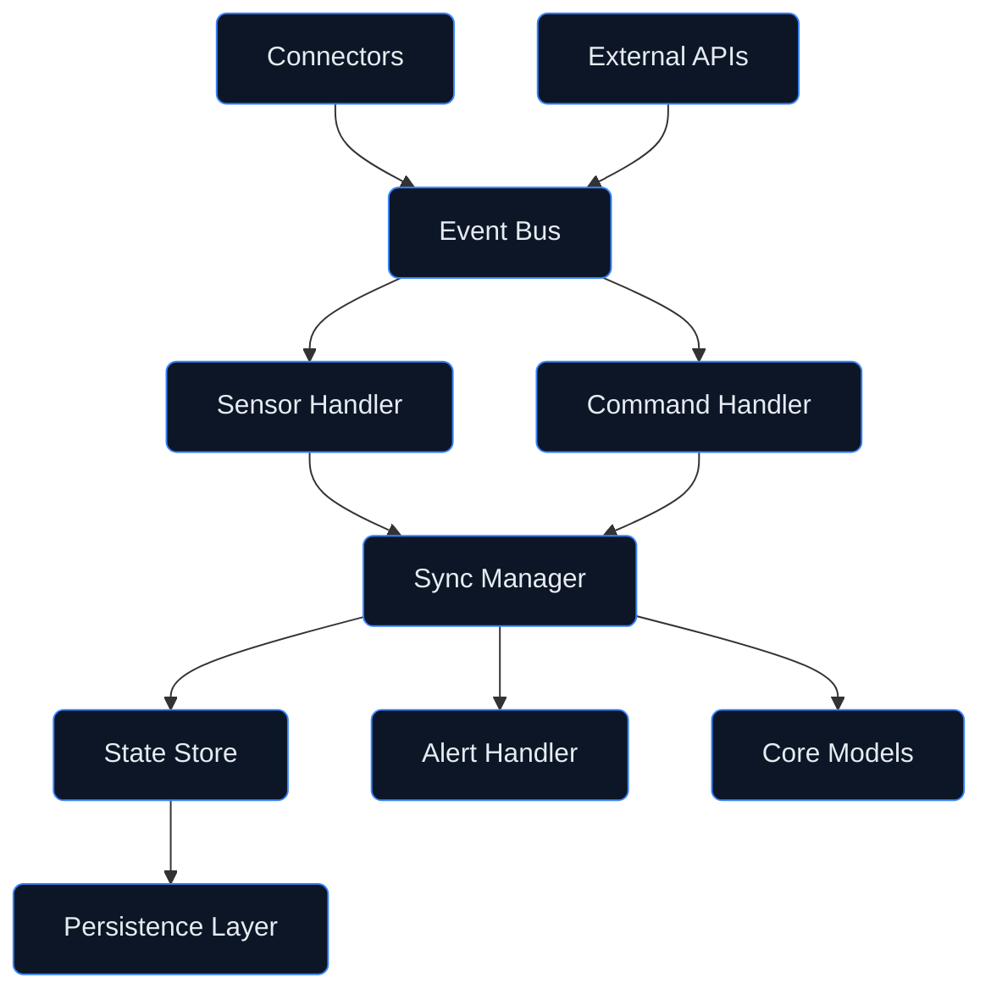

# Digital Twin — Sync Engine
## Real-Time Synchronization Engine

**Version:** 1.0.0  
**Status:** Active Development  
**Last Updated:** 2026-01-29

---

## Document Control

| Property | Value |
|----------|-------|
| Document ID | DT-SYNC-001 |
| Classification | CONSORTIUM |
| Approver | STK_SE |
| Review Cycle | Quarterly |

---

## 1. Overview

The **sync_engine/** directory contains the real-time synchronization engine that maintains consistency between physical aircraft systems and their digital twin representations. The engine provides:

- **Real-Time Synchronization** — Sub-second latency data updates
- **State Reconciliation** — Conflict resolution and consistency
- **Event Processing** — Asynchronous event handling
- **Distributed Coordination** — Multi-node synchronization

---

## 2. Directory Structure

```
sync_engine/
├── README.md                     # This file
├── core/                         # Core synchronization components
│   ├── sync_manager.py           # Main synchronization manager
│   ├── state_store.py            # State storage and retrieval
│   ├── event_bus.py              # Event publishing and subscription
│   └── clock.py                  # Distributed clock synchronization
├── handlers/                     # Event and message handlers
│   ├── sensor_handler.py         # Sensor data handler
│   ├── command_handler.py        # Command message handler
│   ├── state_handler.py          # State change handler
│   └── alert_handler.py          # Alert and notification handler
├── reconciliation/               # State reconciliation
│   ├── conflict_resolver.py      # Conflict resolution strategies
│   ├── consistency_checker.py    # Consistency validation
│   └── rollback_manager.py       # State rollback management
├── scheduling/                   # Task scheduling
│   ├── scheduler.py              # Task scheduler
│   ├── priority_queue.py         # Priority-based task queue
│   └── rate_limiter.py           # Rate limiting
├── persistence/                  # State persistence
│   ├── snapshot.py               # State snapshot management
│   ├── journal.py                # Event journal (write-ahead log)
│   └── recovery.py               # State recovery from persistence
├── distributed/                  # Distributed coordination
│   ├── cluster_manager.py        # Cluster membership management
│   ├── consensus.py              # Consensus protocol (Raft)
│   └── partition_handler.py      # Network partition handling
└── config/                       # Configuration
    ├── sync_config.yaml          # Synchronization configuration
    └── cluster_config.yaml       # Cluster configuration
```

---

## 3. Architecture

### 3.1 Component Overview



### 3.2 Synchronization Flow

```
Physical System → Connector → Event Bus → Handler → Sync Manager → Model Update
                                                          ↓
                                                   State Store → Persistence
```

---

## 4. Core Components

### 4.1 Sync Manager

The central coordination component that manages synchronization:

```python
class SyncManager:
    """Central synchronization manager."""
    
    def __init__(self, config: SyncConfig):
        self.config = config
        self.state_store = StateStore(config.state_config)
        self.event_bus = EventBus(config.event_config)
        self.models: Dict[str, ComponentModel] = {}
    
    async def register_model(self, model: ComponentModel, sources: List[str]) -> None:
        """Register a model for synchronization."""
        self.models[model.component_id] = model
        for source in sources:
            await self.event_bus.subscribe(source, self._create_handler(model))
    
    async def sync(self, component_id: str, data: Dict[str, Any]) -> SyncResult:
        """Synchronize model with new data."""
        model = self.models[component_id]
        
        # Apply update
        await model.update(data)
        
        # Store state
        await self.state_store.put(component_id, model.state)
        
        # Publish state change event
        await self.event_bus.publish(f"state.{component_id}", model.state)
        
        return SyncResult(success=True, timestamp=utc_now())
```

### 4.2 Event Bus

Publish-subscribe messaging for event distribution:

```python
class EventBus:
    """Asynchronous event bus for internal communication."""
    
    async def publish(self, topic: str, message: Any) -> None:
        """Publish message to topic."""
        pass
    
    async def subscribe(self, topic: str, handler: Callable) -> Subscription:
        """Subscribe to topic with handler."""
        pass
    
    async def unsubscribe(self, subscription: Subscription) -> None:
        """Unsubscribe from topic."""
        pass
```

### 4.3 State Store

Persistent state storage with versioning:

```python
class StateStore:
    """Versioned state storage."""
    
    async def get(self, key: str, version: Optional[int] = None) -> StateEntry:
        """Get state by key, optionally at specific version."""
        pass
    
    async def put(self, key: str, value: Dict[str, Any]) -> int:
        """Store state and return new version number."""
        pass
    
    async def history(self, key: str, limit: int = 100) -> List[StateEntry]:
        """Get state history for key."""
        pass
```

---

## 5. Synchronization Modes

### 5.1 Mode Comparison

| Mode | Latency | Consistency | Use Case |
|------|---------|-------------|----------|
| **Real-Time** | <100ms | Eventual | Live telemetry |
| **Batch** | 1-60s | Strong | Historical data |
| **On-Demand** | Variable | Strong | User-triggered |
| **Scheduled** | Configurable | Strong | Periodic sync |

### 5.2 Real-Time Synchronization

```python
from sync_engine import SyncManager, RealTimeMode

# Configure real-time sync
sync = SyncManager(
    mode=RealTimeMode(
        max_latency_ms=100,
        buffer_size=1000,
        flush_interval_ms=50
    )
)

# Register models
sync.register_model(battery_model, sources=["arinc_429.bat"])
sync.register_model(fuel_model, sources=["arinc_429.fuel"])

# Start synchronization
await sync.start()
```

### 5.3 Batch Synchronization

```python
from sync_engine import SyncManager, BatchMode

# Configure batch sync
sync = SyncManager(
    mode=BatchMode(
        batch_size=10000,
        batch_interval_s=60,
        parallelism=4
    )
)

# Sync historical data
await sync.sync_batch(
    start_time="2026-01-01T00:00:00Z",
    end_time="2026-01-29T00:00:00Z"
)
```

---

## 6. State Reconciliation

### 6.1 Conflict Resolution Strategies

| Strategy | Description | Use Case |
|----------|-------------|----------|
| **Last-Write-Wins** | Latest timestamp wins | Low-criticality data |
| **First-Write-Wins** | Earliest timestamp wins | Audit-critical data |
| **Merge** | Combine conflicting states | Composite updates |
| **Manual** | Flag for human review | Safety-critical data |

### 6.2 Conflict Resolution Example

```python
from sync_engine.reconciliation import ConflictResolver, Strategy

# Configure conflict resolver
resolver = ConflictResolver(
    default_strategy=Strategy.LAST_WRITE_WINS,
    overrides={
        "safety.*": Strategy.MANUAL,
        "audit.*": Strategy.FIRST_WRITE_WINS
    }
)

# Resolve conflict
result = resolver.resolve(
    local_state={"temperature": 25.0, "timestamp": "2026-01-29T10:00:00Z"},
    remote_state={"temperature": 26.0, "timestamp": "2026-01-29T10:00:01Z"}
)
```

---

## 7. Distributed Coordination

### 7.1 Cluster Architecture

```
┌─────────────────────────────────────────────────────────────┐
│                     Sync Engine Cluster                     │
├─────────────────────────────────────────────────────────────┤
│   ┌─────────┐     ┌─────────┐     ┌─────────┐              │
│   │ Node 1  │ ←→  │ Node 2  │ ←→  │ Node 3  │              │
│   │ (Leader)│     │(Follower│     │(Follower│              │
│   └─────────┘     └─────────┘     └─────────┘              │
│         ↑               ↑               ↑                   │
│         └───────────────┼───────────────┘                   │
│                    Consensus                                │
└─────────────────────────────────────────────────────────────┘
```

### 7.2 Consensus Protocol

The sync engine uses Raft consensus for distributed state:

```python
from sync_engine.distributed import ClusterManager

# Initialize cluster
cluster = ClusterManager(
    node_id="node-1",
    peers=["node-2:5000", "node-3:5000"],
    election_timeout_ms=150,
    heartbeat_interval_ms=50
)

# Start cluster coordination
await cluster.start()
```

---

## 8. Persistence

### 8.1 Write-Ahead Log

```python
from sync_engine.persistence import Journal

# Initialize journal
journal = Journal(
    path="/data/sync_engine/journal",
    max_segment_size_mb=64,
    sync_mode="fsync"
)

# Append entry
await journal.append(entry)

# Recover from journal
async for entry in journal.recover():
    await apply_entry(entry)
```

### 8.2 State Snapshots

```python
from sync_engine.persistence import SnapshotManager

# Initialize snapshot manager
snapshots = SnapshotManager(
    path="/data/sync_engine/snapshots",
    interval_entries=10000,
    retention_count=5
)

# Create snapshot
await snapshots.create(state_store)

# Restore from snapshot
await snapshots.restore(state_store)
```

---

## 9. Configuration

### 9.1 Synchronization Configuration

```yaml
# config/sync_config.yaml
sync_engine:
  mode: real_time
  max_latency_ms: 100
  buffer_size: 10000
  
state_store:
  backend: redis
  connection:
    host: localhost
    port: 6379
    db: 0
  
event_bus:
  backend: kafka
  connection:
    brokers: ["kafka-1:9092", "kafka-2:9092"]
    topic_prefix: "sync_engine"
    
persistence:
  journal:
    enabled: true
    path: /data/journal
  snapshots:
    enabled: true
    path: /data/snapshots
    interval: 10000
```

---

## 10. Monitoring

### 10.1 Metrics

| Metric | Description | Target |
|--------|-------------|--------|
| `sync_latency_ms` | End-to-end sync latency | <100ms |
| `sync_throughput` | Events processed per second | >10K/s |
| `state_store_size` | Number of stored states | N/A |
| `journal_lag` | Uncommitted journal entries | <100 |

### 10.2 Health Check Endpoint

```bash
curl http://localhost:8080/health

{
  "status": "healthy",
  "components": {
    "event_bus": "connected",
    "state_store": "connected",
    "journal": "writable",
    "cluster": "leader"
  },
  "metrics": {
    "latency_p99_ms": 45,
    "throughput_eps": 12500
  }
}
```

---

## 11. Testing

### 11.1 Unit Tests

```bash
# Run sync engine tests
pytest sync_engine/tests/ -v

# Run with coverage
pytest sync_engine/tests/ --cov=sync_engine --cov-report=html
```

### 11.2 Chaos Testing

```bash
# Run chaos tests
pytest sync_engine/tests/chaos/ -v --chaos

# Test network partitions
pytest sync_engine/tests/chaos/test_partitions.py -v
```

---

## 12. Related Documentation

- [Digital Twin Architecture](../README.md)
- [Connectors](../connectors/README.md)
- [Core Models](../models/README.md)
- [Validation Tools](../validation/README.md)

---

## 13. Revision History

| Date | Version | Author | Change |
|------|---------|--------|--------|
| 2026-01-29 | 1.0.0 | STK_SE | Initial sync engine structure |

---

*This directory contains the real-time synchronization engine for the AMPEL360 Q100 digital twin, maintaining consistency between physical systems and their digital representations.*
