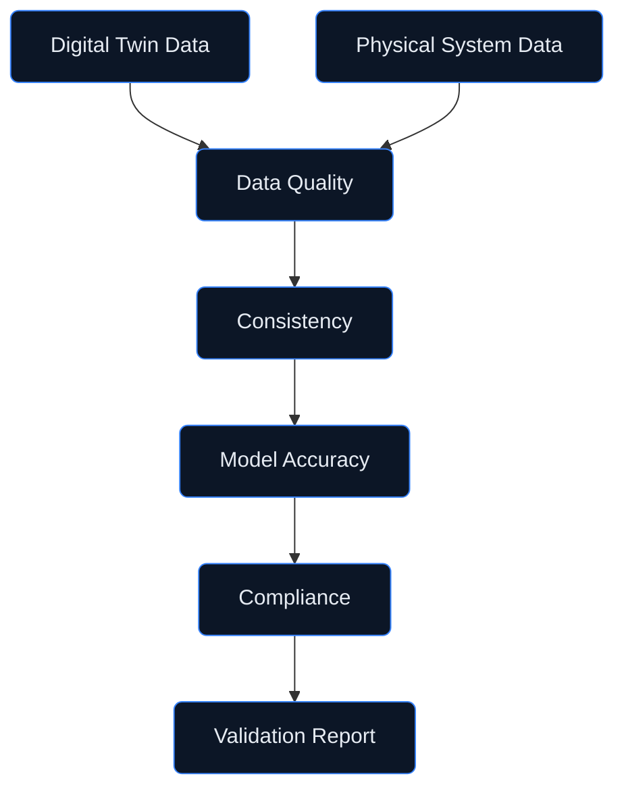

# Digital Twin — Validation
## Verification and Testing Tools

**Version:** 1.0.0  
**Status:** Active Development  
**Last Updated:** 2026-01-29

---

## Document Control

| Property | Value |
|----------|-------|
| Document ID | DT-VAL-001 |
| Classification | CONSORTIUM |
| Approver | STK_QA |
| Review Cycle | Quarterly |

---

## 1. Overview

The **validation/** directory contains validation and verification tools for the AMPEL360 Q100 digital twin. These tools ensure:

- **Model Accuracy** — Validation against physical system data
- **Data Quality** — Sensor data validation and cleansing
- **Consistency Checks** — State consistency verification
- **Compliance Validation** — Regulatory and standards compliance

---

## 2. Directory Structure

```
validation/
├── README.md                     # This file
├── model_validation/             # Model accuracy validation
│   ├── accuracy_tests.py         # Model accuracy testing
│   ├── regression_tests.py       # Regression testing suite
│   ├── benchmark_runner.py       # Performance benchmarks
│   └── comparison_tools.py       # Physical vs digital comparison
├── data_quality/                 # Data quality validation
│   ├── schema_validator.py       # Schema validation
│   ├── range_checker.py          # Value range validation
│   ├── anomaly_detector.py       # Data anomaly detection
│   └── completeness_checker.py   # Data completeness validation
├── consistency/                  # Consistency validation
│   ├── state_validator.py        # State consistency checks
│   ├── temporal_checker.py       # Temporal consistency
│   ├── cross_model_validator.py  # Cross-model consistency
│   └── invariant_checker.py      # Invariant verification
├── compliance/                   # Compliance validation
│   ├── do178c_checker.py         # DO-178C compliance checks
│   ├── do254_checker.py          # DO-254 compliance checks
│   ├── easa_cs25_checker.py      # EASA CS-25 compliance
│   └── report_generator.py       # Compliance report generation
├── reports/                      # Validation reports
│   ├── templates/                # Report templates
│   └── generated/                # Generated reports
└── config/                       # Configuration
    ├── validation_config.yaml    # Validation configuration
    └── thresholds.yaml           # Validation thresholds
```

---

## 3. Validation Framework

### 3.1 Validation Pipeline



### 3.2 Validation Levels

| Level | Description | Frequency | Scope |
|-------|-------------|-----------|-------|
| **L1 - Continuous** | Real-time validation | Per update | Individual values |
| **L2 - Periodic** | Scheduled validation | Hourly/Daily | Model state |
| **L3 - Event-based** | Triggered validation | On events | Full system |
| **L4 - Certification** | Formal validation | Milestones | Complete suite |

---

## 4. Model Validation

### 4.1 Accuracy Testing

```python
from validation.model_validation import AccuracyTest

# Configure accuracy test
test = AccuracyTest(
    model_id="battery-model-001",
    reference_data="test_data/battery_reference.csv",
    metrics=["mae", "rmse", "r2", "mape"],
    tolerance={
        "mae": 0.05,      # 5% mean absolute error
        "rmse": 0.08,     # 8% root mean square error
        "r2": 0.95,       # R² coefficient >= 0.95
        "mape": 0.03      # 3% mean absolute percentage error
    }
)

# Run test
result = test.run()

# Check results
if result.passed:
    print("✅ Model accuracy validation passed")
else:
    print(f"❌ Validation failed: {result.failures}")
```

### 4.2 Physical-Digital Comparison

```python
from validation.model_validation.comparison_tools import PhysicalDigitalComparison

# Compare digital twin with physical measurements
comparison = PhysicalDigitalComparison(
    digital_source="sync_engine/state_store",
    physical_source="test_data/flight_test_001.csv",
    time_alignment="interpolate",
    parameters=[
        "battery.soc",
        "fuel.tank_level",
        "propulsion.thrust"
    ]
)

# Run comparison
report = comparison.compare(
    start_time="2026-01-15T10:00:00Z",
    end_time="2026-01-15T12:00:00Z"
)

# Generate comparison plot
report.plot_comparison(output="reports/generated/comparison_001.html")
```

### 4.3 Regression Testing

```python
from validation.model_validation import RegressionTestSuite

# Define regression test suite
suite = RegressionTestSuite(
    name="battery-model-regression",
    baseline="baselines/battery_model_v1.2.json"
)

# Add test cases
suite.add_test("nominal_operation", "test_cases/battery_nominal.csv")
suite.add_test("high_load", "test_cases/battery_high_load.csv")
suite.add_test("low_temperature", "test_cases/battery_low_temp.csv")

# Run suite
results = suite.run()

# Check for regressions
if results.has_regressions:
    print(f"⚠️ Regressions detected: {results.regressions}")
```

---

## 5. Data Quality Validation

### 5.1 Schema Validation

```python
from validation.data_quality import SchemaValidator

# Initialize validator
validator = SchemaValidator(
    schema_path="schemas/sensor_data_schema.json"
)

# Validate data
data = load_sensor_data()
result = validator.validate(data)

if not result.valid:
    for error in result.errors:
        print(f"Schema error: {error.path} - {error.message}")
```

### 5.2 Range Validation

```python
from validation.data_quality import RangeChecker

# Configure range checker
checker = RangeChecker(
    ranges={
        "temperature_k": (15.0, 35.0),
        "pressure_bar": (0.5, 5.0),
        "voltage_v": (350.0, 450.0)
    },
    action="flag"  # flag, reject, or clamp
)

# Check data
result = checker.check(data)
print(f"Out of range values: {result.out_of_range_count}")
```

### 5.3 Completeness Validation

```python
from validation.data_quality import CompletenessChecker

# Configure completeness checker
checker = CompletenessChecker(
    required_fields=["timestamp", "sensor_id", "value"],
    expected_interval_s=1.0,
    max_gap_s=5.0
)

# Check completeness
result = checker.check(data)
print(f"Completeness: {result.completeness:.1%}")
print(f"Gaps detected: {len(result.gaps)}")
```

---

## 6. Consistency Validation

### 6.1 State Consistency

```python
from validation.consistency import StateValidator

# Configure state validator
validator = StateValidator(
    rules=[
        "battery.soc >= 0 and battery.soc <= 1",
        "fuel.tank_level >= 0 and fuel.tank_level <= fuel.tank_capacity",
        "propulsion.thrust >= 0"
    ]
)

# Validate state
state = get_model_state()
result = validator.validate(state)

if not result.consistent:
    for violation in result.violations:
        print(f"Consistency violation: {violation}")
```

### 6.2 Cross-Model Consistency

```python
from validation.consistency import CrossModelValidator

# Configure cross-model validator
validator = CrossModelValidator(
    constraints=[
        {
            "name": "energy_conservation",
            "models": ["battery", "fuel_cell", "motor"],
            "rule": "battery.power_out + fuel_cell.power_out == motor.power_in + losses"
        },
        {
            "name": "fuel_mass_balance",
            "models": ["tank", "distribution", "delivery"],
            "rule": "tank.outflow == distribution.inflow"
        }
    ]
)

# Validate consistency
result = validator.validate()
```

### 6.3 Temporal Consistency

```python
from validation.consistency import TemporalChecker

# Configure temporal checker
checker = TemporalChecker(
    max_clock_drift_ms=100,
    causality_check=True,
    monotonicity_check=True
)

# Check temporal consistency
events = get_event_stream()
result = checker.check(events)

if result.causality_violations:
    print(f"Causality violations: {result.causality_violations}")
```

---

## 7. Compliance Validation

### 7.1 DO-178C Compliance

```python
from validation.compliance import DO178CChecker

# Initialize DO-178C checker
checker = DO178CChecker(
    dal_level="C",  # Design Assurance Level
    objectives=[
        "traceability",
        "test_coverage",
        "code_review",
        "requirements_verification"
    ]
)

# Run compliance check
result = checker.check(
    requirements="docs/requirements/",
    source_code="digital_twin/",
    test_results="reports/test_results/"
)

# Generate compliance matrix
checker.generate_compliance_matrix("reports/generated/do178c_matrix.xlsx")
```

### 7.2 EASA CS-25 Compliance

```python
from validation.compliance import EASA_CS25_Checker

# Initialize CS-25 checker
checker = EASA_CS25_Checker(
    chapters=["CS 25.1301", "CS 25.1309", "CS 25.1322"]
)

# Run compliance check
result = checker.check(component="digital_twin_system")

# Generate compliance report
checker.generate_report("reports/generated/cs25_compliance.pdf")
```

---

## 8. Validation Reports

### 8.1 Report Types

| Report Type | Format | Audience | Frequency |
|-------------|--------|----------|-----------|
| **Summary** | HTML | All stakeholders | Daily |
| **Detailed** | PDF | Engineers | Weekly |
| **Compliance** | PDF/Excel | Certification | Milestones |
| **Trend** | HTML | Management | Monthly |

### 8.2 Report Generation

```python
from validation.reports import ReportGenerator

# Configure report generator
generator = ReportGenerator(
    template="templates/validation_report.html",
    output_dir="reports/generated/"
)

# Generate report
report = generator.generate(
    validation_results=results,
    report_type="summary",
    period="2026-01-01/2026-01-29"
)

print(f"Report generated: {report.path}")
```

---

## 9. Configuration

### 9.1 Validation Configuration

```yaml
# config/validation_config.yaml
validation:
  levels:
    continuous:
      enabled: true
      checks: [schema, range, temporal]
    periodic:
      enabled: true
      interval: 3600  # seconds
      checks: [consistency, accuracy]
    event_based:
      enabled: true
      triggers: [model_update, anomaly_detected]
      checks: [full_suite]
  
  reporting:
    format: html
    output_dir: reports/generated/
    retention_days: 90
```

### 9.2 Thresholds Configuration

```yaml
# config/thresholds.yaml
thresholds:
  accuracy:
    battery_soc:
      mae: 0.02
      rmse: 0.03
    tank_level:
      mae: 0.01
      rmse: 0.02
  
  completeness:
    minimum: 0.99
    critical_fields: [timestamp, sensor_id, value]
  
  consistency:
    max_drift_ms: 100
    tolerance: 0.001
```

---

## 10. Testing

### 10.1 Unit Tests

```bash
# Run validation tool tests
pytest validation/tests/ -v

# Run with coverage
pytest validation/tests/ --cov=validation --cov-report=html
```

### 10.2 Integration Tests

```bash
# Run integration tests
pytest validation/tests/integration/ -v --integration
```

---

## 11. Related Documentation

- [Digital Twin Architecture](../README.md)
- [Core Models](../models/README.md)
- [ML Models](../ml_models/README.md)
- [Sync Engine](../sync_engine/README.md)

---

## 12. Revision History

| Date | Version | Author | Change |
|------|---------|--------|--------|
| 2026-01-29 | 1.0.0 | STK_QA | Initial validation tools structure |

---

*This directory contains validation and verification tools for the AMPEL360 Q100 digital twin, ensuring model accuracy, data quality, and compliance with aviation standards.*
