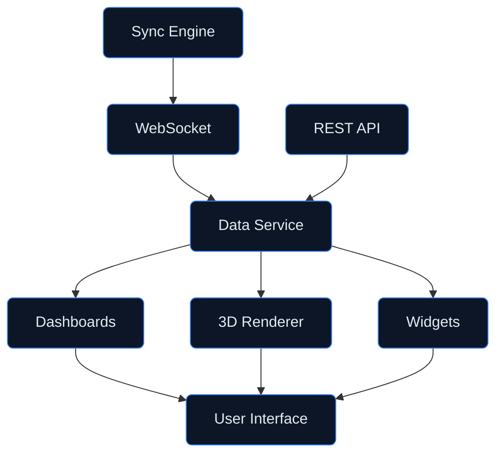

# Digital Twin — Visualization
## Interactive Dashboards and 3D Rendering

**Version:** 1.0.0  
**Status:** Active Development  
**Last Updated:** 2026-01-29

---

## Document Control

| Property | Value |
|----------|-------|
| Document ID | DT-VIS-001 |
| Classification | CONSORTIUM |
| Approver | STK_UI |
| Review Cycle | Quarterly |

---

## 1. Overview

The **visualization/** directory contains visualization components and dashboards for the AMPEL360 Q100 digital twin. These components provide:

- **Real-Time Dashboards** — Live metrics and status displays
- **3D Model Rendering** — Interactive aircraft component visualization
- **Alert Management** — Priority-based notification displays
- **Historical Analysis** — Trend charts and reporting tools

---

## 2. Directory Structure

```
visualization/
├── README.md                     # This file
├── dashboards/                   # Dashboard components
│   ├── overview/                 # System overview dashboard
│   ├── electrical/               # Electrical system dashboard
│   ├── fuel/                     # Fuel system dashboard
│   ├── propulsion/               # Propulsion system dashboard
│   └── alerts/                   # Alert management dashboard
├── 3d/                           # 3D visualization components
│   ├── renderer/                 # WebGL renderer
│   ├── models/                   # 3D model assets
│   ├── controls/                 # Camera and interaction controls
│   └── overlays/                 # Data overlay components
├── widgets/                      # Reusable UI widgets
│   ├── gauges/                   # Gauge components
│   ├── charts/                   # Chart components
│   ├── indicators/               # Status indicators
│   └── tables/                   # Data table components
├── themes/                       # Visual themes
│   ├── light/                    # Light theme
│   ├── dark/                     # Dark theme
│   └── aerospace/                # Aerospace-standard theme
├── api/                          # Visualization API
│   ├── websocket.ts              # WebSocket client
│   ├── rest.ts                   # REST API client
│   └── streaming.ts              # Data streaming utilities
└── config/                       # Configuration
    ├── dashboard_config.yaml     # Dashboard configuration
    └── theme_config.yaml         # Theme configuration
```

---

## 3. Architecture

### 3.1 Component Overview



### 3.2 Technology Stack

| Layer | Technology | Purpose |
|-------|------------|---------|
| **Framework** | React 18 | UI component library |
| **3D Rendering** | Three.js | WebGL-based 3D visualization |
| **Charts** | D3.js / Recharts | Data visualization |
| **State** | Zustand | State management |
| **Styling** | Tailwind CSS | Utility-first CSS |
| **Real-time** | Socket.io | WebSocket communication |

---

## 4. Dashboards

### 4.1 System Overview Dashboard

The main dashboard providing a holistic view of the digital twin:

| Widget | Description | Refresh Rate |
|--------|-------------|--------------|
| Aircraft 3D View | Interactive 3D aircraft model | 60 fps |
| System Status | Overall system health indicators | 1s |
| Active Alerts | Priority-sorted alert list | Real-time |
| Performance Metrics | KPI gauges and trends | 5s |

### 4.2 Electrical System Dashboard (ATA 24)

| Widget | Description | Data Source |
|--------|-------------|-------------|
| Battery SOC Gauge | Battery state of charge | `models/electrical/battery` |
| Power Distribution | Bus voltage and load visualization | `models/electrical/power` |
| Fuel Cell Status | Fuel cell stack performance | `models/electrical/fuel_cell` |
| Energy Flow Diagram | Sankey diagram of energy flow | Computed |

### 4.3 Fuel System Dashboard (ATA 28)

| Widget | Description | Data Source |
|--------|-------------|-------------|
| Tank Level Indicators | LH₂ tank fill levels | `models/fuel/tank` |
| Temperature Map | Cryogenic temperature distribution | `models/fuel/tank` |
| Flow Rate Chart | Fuel flow rate over time | `models/fuel/distribution` |
| Boil-off Monitor | Boil-off rate and predictions | `ml_models/predictive` |

---

## 5. 3D Visualization

### 5.1 Renderer Features

- **WebGL 2.0** — High-performance GPU rendering
- **PBR Materials** — Physically-based rendering materials
- **LOD System** — Level of detail for performance
- **Instancing** — Efficient rendering of repeated components

### 5.2 Interaction Modes

| Mode | Description | Controls |
|------|-------------|----------|
| **Orbit** | Rotate around aircraft | Left-click drag |
| **Pan** | Move view laterally | Right-click drag |
| **Zoom** | Adjust view distance | Scroll wheel |
| **Select** | Select component for details | Click on component |
| **Measure** | Measure distances | Shift+click two points |

### 5.3 Data Overlays

```typescript
// Example: Temperature overlay
const temperatureOverlay = new DataOverlay({
  type: 'heatmap',
  dataSource: 'models/fuel/tank.temperature_distribution',
  colorScale: ['blue', 'green', 'yellow', 'red'],
  range: [20, 30], // Kelvin
  opacity: 0.7
});

renderer.addOverlay(temperatureOverlay);
```

---

## 6. Widgets

### 6.1 Gauge Components

```typescript
import { RadialGauge, LinearGauge, ArcGauge } from 'widgets/gauges';

// Radial gauge for battery SOC
<RadialGauge
  value={batterySOC}
  min={0}
  max={100}
  unit="%"
  label="Battery SOC"
  zones={[
    { from: 0, to: 20, color: 'red' },
    { from: 20, to: 40, color: 'yellow' },
    { from: 40, to: 100, color: 'green' }
  ]}
/>
```

### 6.2 Chart Components

```typescript
import { TimeSeriesChart, SparklineChart } from 'widgets/charts';

// Time series chart for temperature history
<TimeSeriesChart
  data={temperatureHistory}
  xKey="timestamp"
  yKey="temperature"
  yLabel="Temperature (K)"
  timeRange="1h"
  refreshInterval={5000}
/>
```

### 6.3 Status Indicators

```typescript
import { StatusLight, StatusBadge, AlertBanner } from 'widgets/indicators';

// Status light for system health
<StatusLight
  status={systemHealth}
  labels={{
    nominal: 'System Nominal',
    degraded: 'Degraded Performance',
    critical: 'Critical Alert'
  }}
/>
```

---

## 7. Themes

### 7.1 Available Themes

| Theme | Description | Use Case |
|-------|-------------|----------|
| **Light** | Light background, dark text | Daylight environments |
| **Dark** | Dark background, light text | Low-light environments |
| **Aerospace** | MIL-STD-1472 compliant colors | Cockpit displays |

### 7.2 Theme Configuration

```yaml
# config/theme_config.yaml
aerospace:
  colors:
    background: "#0a0a0a"
    foreground: "#00ff00"
    warning: "#ffff00"
    caution: "#ffaa00"
    alert: "#ff0000"
    info: "#00ffff"
  fonts:
    primary: "IBM Plex Mono"
    display: "Roboto Condensed"
  gauges:
    needle_color: "#ffffff"
    dial_color: "#1a1a1a"
```

---

## 8. Real-Time Data

### 8.1 WebSocket Connection

```typescript
import { useDigitalTwinStream } from 'api/streaming';

function Dashboard() {
  const { data, status, error } = useDigitalTwinStream({
    topics: ['models/electrical/*', 'models/fuel/*'],
    bufferSize: 100
  });

  if (status === 'connecting') return <LoadingSpinner />;
  if (error) return <ErrorDisplay error={error} />;

  return <DashboardContent data={data} />;
}
```

### 8.2 Data Buffering

```typescript
import { DataBuffer } from 'api/streaming';

// Create rolling buffer for chart data
const buffer = new DataBuffer({
  maxSize: 3600,        // 1 hour at 1s intervals
  interpolation: true,  // Fill gaps with interpolated values
  downsampling: 'lttb'  // Largest-Triangle-Three-Buckets
});
```

---

## 9. Alert Management

### 9.1 Alert Priorities

| Priority | Color | Sound | Action Required |
|----------|-------|-------|-----------------|
| **Critical** | Red | Alarm | Immediate |
| **Warning** | Amber | Chime | Near-term |
| **Caution** | Yellow | None | Awareness |
| **Advisory** | Blue | None | Information |

### 9.2 Alert Component

```typescript
import { AlertPanel, AlertItem } from 'dashboards/alerts';

<AlertPanel
  alerts={activeAlerts}
  maxVisible={10}
  sortBy="priority"
  onAcknowledge={handleAcknowledge}
  onDismiss={handleDismiss}
/>
```

---

## 10. Development

### 10.1 Local Development

```bash
# Install dependencies
npm install

# Start development server
npm run dev

# Run storybook for component development
npm run storybook
```

### 10.2 Building

```bash
# Build for production
npm run build

# Build with source maps
npm run build:debug
```

### 10.3 Testing

```bash
# Run unit tests
npm test

# Run visual regression tests
npm run test:visual

# Run accessibility tests
npm run test:a11y
```

---

## 11. Accessibility

### 11.1 WCAG 2.1 Compliance

| Criterion | Level | Status |
|-----------|-------|--------|
| Color Contrast | AA | ✅ |
| Keyboard Navigation | A | ✅ |
| Screen Reader Support | AA | ✅ |
| Focus Indicators | A | ✅ |

### 11.2 Accessibility Features

- **High Contrast Mode** — Enhanced visibility theme
- **Reduced Motion** — Respects `prefers-reduced-motion`
- **Screen Reader Labels** — ARIA labels for all interactive elements
- **Keyboard Shortcuts** — Full keyboard navigation support

---

## 12. Related Documentation

- [Digital Twin Architecture](../README.md)
- [Sync Engine](../sync_engine/README.md)
- [Core Models](../models/README.md)
- [ML Models](../ml_models/README.md)

---

## 13. Revision History

| Date | Version | Author | Change |
|------|---------|--------|--------|
| 2026-01-29 | 1.0.0 | STK_UI | Initial visualization structure |

---

*This directory contains visualization components and dashboards for the AMPEL360 Q100 digital twin, providing real-time monitoring and interactive 3D visualization capabilities.*